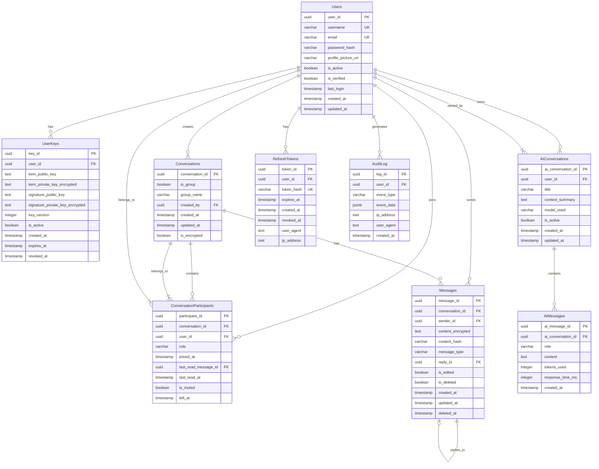

# Database Design - QuantumResilientCommunication

## Overview

This document defines the relational database schema for the Quantum-Resilient Communication System. The design focuses on scalability, security, and support for post-quantum cryptography and AI-powered features.

**Cryptography Stack:**
- **Key Encapsulation**: ML-KEM (Kyber)
- **Digital Signatures**: ML-DSA (Dilithium)
- **Symmetric Encryption**: AES-256-GCM

---

## Table Definitions

### 1. Users

**Purpose**: Stores user authentication and profile information.

| Column | Type | Constraints | Description |
|--------|------|-------------|-------------|
| user_id | UUID | PRIMARY KEY | Unique identifier for the user |
| username | VARCHAR(50) | UNIQUE, NOT NULL | User's display name |
| email | VARCHAR(255) | UNIQUE, NOT NULL | User's email address |
| password_hash | VARCHAR(255) | NOT NULL | Bcrypt hashed password |
| profile_picture_url | VARCHAR(500) | NULL | URL to profile picture |
| is_active | BOOLEAN | DEFAULT TRUE | Account status |
| is_verified | BOOLEAN | DEFAULT FALSE | Email verification status |
| last_login | TIMESTAMP | NULL | Last successful login time |
| created_at | TIMESTAMP | DEFAULT CURRENT_TIMESTAMP | Account creation time |
| updated_at | TIMESTAMP | DEFAULT CURRENT_TIMESTAMP | Last profile update |

**Indexes**:
- `idx_users_email` on email
- `idx_users_username` on username
- `idx_users_created_at` on created_at

---

### 2. UserKeys

**Purpose**: Stores post-quantum cryptographic key pairs for users. Supports ML-KEM for key encapsulation and ML-DSA for digital signatures.

| Column | Type | Constraints | Description |
|--------|------|-------------|-------------|
| key_id | UUID | PRIMARY KEY | Unique identifier for the key pair |
| user_id | UUID | FOREIGN KEY → Users(user_id), NOT NULL | Owner of the key pair |
| kem_public_key | TEXT | NOT NULL | ML-KEM public key (base64 encoded) |
| kem_private_key_encrypted | TEXT | NOT NULL | ML-KEM private key (AES-256-GCM encrypted) |
| signature_public_key | TEXT | NOT NULL | ML-DSA public key (base64 encoded) |
| signature_private_key_encrypted | TEXT | NOT NULL | ML-DSA private key (AES-256-GCM encrypted) |
| key_version | INTEGER | NOT NULL | Version number for key rotation |
| is_active | BOOLEAN | DEFAULT TRUE | Whether this is the current active key |
| created_at | TIMESTAMP | DEFAULT CURRENT_TIMESTAMP | Key generation time |
| expires_at | TIMESTAMP | NULL | Optional expiration time |
| revoked_at | TIMESTAMP | NULL | Revocation time if compromised |

**Indexes**:
- `idx_user_keys_user_id` on user_id
- `idx_user_keys_active` on (user_id, is_active) WHERE is_active = TRUE
- `idx_user_keys_version` on (user_id, key_version)

**Constraints**:
- UNIQUE constraint on (user_id, key_version)

**Notes**:
- ML-KEM (Module-Lattice Key Encapsulation Mechanism) is used for secure key exchange
- ML-DSA (Module-Lattice Digital Signature Algorithm) is used for message authentication
- Private keys are encrypted with AES-256-GCM before storage

---

### 3. Conversations

**Purpose**: Represents chat conversations between users (1-on-1 or group).

| Column | Type | Constraints | Description |
|--------|------|-------------|-------------|
| conversation_id | UUID | PRIMARY KEY | Unique identifier for the conversation |
| is_group | BOOLEAN | DEFAULT FALSE | Group vs 1-on-1 conversation |
| group_name | VARCHAR(255) | NULL | Name for group conversations |
| created_by | UUID | FOREIGN KEY → Users(user_id), NOT NULL | User who initiated the conversation |
| created_at | TIMESTAMP | DEFAULT CURRENT_TIMESTAMP | Conversation creation time |
| updated_at | TIMESTAMP | DEFAULT CURRENT_TIMESTAMP | Last message time |
| is_encrypted | BOOLEAN | DEFAULT TRUE | End-to-end encryption status |

**Indexes**:
- `idx_conversations_created_by` on created_by
- `idx_conversations_updated_at` on updated_at

**Notes**:
- All conversations use the same post-quantum cryptography stack (ML-KEM, ML-DSA, AES-256-GCM)
- No algorithm selection is required; the protocol is fixed

---

### 4. ConversationParticipants

**Purpose**: Junction table for many-to-many relationship between users and conversations.

| Column | Type | Constraints | Description |
|--------|------|-------------|-------------|
| participant_id | UUID | PRIMARY KEY | Unique identifier |
| conversation_id | UUID | FOREIGN KEY → Conversations(conversation_id), NOT NULL | Reference to conversation |
| user_id | UUID | FOREIGN KEY → Users(user_id), NOT NULL | Reference to user |
| role | VARCHAR(20) | DEFAULT 'member' | Role: 'admin', 'member' |
| joined_at | TIMESTAMP | DEFAULT CURRENT_TIMESTAMP | When user joined |
| last_read_message_id | UUID | FOREIGN KEY → Messages(message_id), NULL | Last message read by user |
| last_read_at | TIMESTAMP | NULL | Timestamp of last read |
| is_muted | BOOLEAN | DEFAULT FALSE | Notification mute status |
| left_at | TIMESTAMP | NULL | When user left (NULL if still member) |

**Indexes**:
- `idx_participants_conversation` on conversation_id
- `idx_participants_user` on user_id
- `idx_participants_active` on (user_id, left_at) WHERE left_at IS NULL

**Constraints**:
- UNIQUE constraint on (conversation_id, user_id) WHERE left_at IS NULL

---

### 5. Messages

**Purpose**: Stores individual messages within conversations.

| Column | Type | Constraints | Description |
|--------|------|-------------|-------------|
| message_id | UUID | PRIMARY KEY | Unique identifier for the message |
| conversation_id | UUID | FOREIGN KEY → Conversations(conversation_id), NOT NULL | Reference to conversation |
| sender_id | UUID | FOREIGN KEY → Users(user_id), NOT NULL | User who sent the message |
| content_encrypted | TEXT | NOT NULL | Encrypted message content (AES-256-GCM) |
| content_hash | VARCHAR(255) | NOT NULL | SHA-256 hash for integrity verification |
| message_type | VARCHAR(20) | DEFAULT 'text' | Type: 'text', 'image', 'file', 'audio', 'system' |
| reply_to | UUID | FOREIGN KEY → Messages(message_id), NULL | Parent message if reply |
| is_edited | BOOLEAN | DEFAULT FALSE | Edit status |
| is_deleted | BOOLEAN | DEFAULT FALSE | Soft delete flag |
| created_at | TIMESTAMP | DEFAULT CURRENT_TIMESTAMP | Message timestamp |
| updated_at | TIMESTAMP | DEFAULT CURRENT_TIMESTAMP | Edit timestamp |
| deleted_at | TIMESTAMP | NULL | Deletion timestamp |

**Indexes**:
- `idx_messages_conversation` on (conversation_id, created_at)
- `idx_messages_sender` on sender_id
- `idx_messages_created_at` on created_at

**Notes**:
- Messages are encrypted using AES-256-GCM session keys
- Session keys are exchanged using ML-KEM
- Messages are signed using ML-DSA for authentication
- No per-message encryption keys in Version 1

---

### 6. AIConversations

**Purpose**: Stores persistent AI assistant conversations for users.

| Column | Type | Constraints | Description |
|--------|------|-------------|-------------|
| ai_conversation_id | UUID | PRIMARY KEY | Unique identifier |
| user_id | UUID | FOREIGN KEY → Users(user_id), NOT NULL | User who owns the conversation |
| title | VARCHAR(255) | NULL | Auto-generated or user-defined title |
| context_summary | TEXT | NULL | AI-generated summary of conversation |
| model_used | VARCHAR(100) | NOT NULL | AI model identifier (e.g., 'llama3', 'mistral') |
| is_active | BOOLEAN | DEFAULT TRUE | Conversation status |
| created_at | TIMESTAMP | DEFAULT CURRENT_TIMESTAMP | Creation time |
| updated_at | TIMESTAMP | DEFAULT CURRENT_TIMESTAMP | Last interaction time |

**Indexes**:
- `idx_ai_conversations_user` on (user_id, updated_at)
- `idx_ai_conversations_active` on (user_id, is_active) WHERE is_active = TRUE

---

### 7. AIMessages

**Purpose**: Stores individual messages within AI conversations.

| Column | Type | Constraints | Description |
|--------|------|-------------|-------------|
| ai_message_id | UUID | PRIMARY KEY | Unique identifier |
| ai_conversation_id | UUID | FOREIGN KEY → AIConversations(ai_conversation_id), NOT NULL | Reference to AI conversation |
| role | VARCHAR(20) | NOT NULL | Role: 'user', 'assistant', 'system' |
| content | TEXT | NOT NULL | Message content |
| tokens_used | INTEGER | NULL | Token count for this message |
| response_time_ms | INTEGER | NULL | AI response time in milliseconds |
| created_at | TIMESTAMP | DEFAULT CURRENT_TIMESTAMP | Message timestamp |

**Indexes**:
- `idx_ai_messages_conversation` on (ai_conversation_id, created_at)

---

### 8. RefreshTokens

**Purpose**: Stores JWT refresh tokens for session management.

| Column | Type | Constraints | Description |
|--------|------|-------------|-------------|
| token_id | UUID | PRIMARY KEY | Unique identifier |
| user_id | UUID | FOREIGN KEY → Users(user_id), NOT NULL | Token owner |
| token_hash | VARCHAR(255) | UNIQUE, NOT NULL | Hashed refresh token |
| expires_at | TIMESTAMP | NOT NULL | Token expiration time |
| created_at | TIMESTAMP | DEFAULT CURRENT_TIMESTAMP | Issuance time |
| revoked_at | TIMESTAMP | NULL | Revocation time |
| user_agent | TEXT | NULL | Client user agent |
| ip_address | INET | NULL | Client IP address |

**Indexes**:
- `idx_refresh_tokens_user` on user_id
- `idx_refresh_tokens_hash` on token_hash
- `idx_refresh_tokens_expires` on expires_at

**Constraints**:
- UNIQUE constraint on token_hash

---

### 9. AuditLog

**Purpose**: Tracks security-relevant events for compliance and debugging.

| Column | Type | Constraints | Description |
|--------|------|-------------|-------------|
| log_id | UUID | PRIMARY KEY | Unique identifier |
| user_id | UUID | FOREIGN KEY → Users(user_id), NULL | User involved (if applicable) |
| event_type | VARCHAR(50) | NOT NULL | Event: 'login', 'logout', 'key_rotation', 'message_sent', etc. |
| event_data | JSONB | NULL | Additional event details |
| ip_address | INET | NULL | Client IP |
| user_agent | TEXT | NULL | Client user agent |
| created_at | TIMESTAMP | DEFAULT CURRENT_TIMESTAMP | Event timestamp |

**Indexes**:
- `idx_audit_log_user` on (user_id, created_at)
- `idx_audit_log_type` on (event_type, created_at)
- `idx_audit_log_created_at` on created_at

---

## Entity Relationship Diagram



---

## Relationships

### One-to-Many Relationships

1. **Users → UserKeys** (1:N)
   - One user can have multiple key pairs (for rotation)
   - Each key belongs to exactly one user
   - Enables post-quantum key rotation without service interruption
   - Each key pair contains both ML-KEM and ML-DSA keys

2. **Users → Conversations** (1:N)
   - One user can create multiple conversations
   - Each conversation has one creator
   - Tracks conversation ownership

3. **Users → Messages** (1:N)
   - One user can send multiple messages
   - Each message has one sender
   - Core messaging relationship

4. **Users → AIConversations** (1:N)
   - One user can have multiple AI conversations
   - Each AI conversation belongs to one user
   - Enables persistent AI chat history

5. **Conversations → Messages** (1:N)
   - One conversation contains multiple messages
   - Each message belongs to one conversation
   - Core messaging structure

6. **AIConversations → AIMessages** (1:N)
   - One AI conversation contains multiple messages
   - Each AI message belongs to one conversation
   - Maintains AI chat history

7. **Users → RefreshTokens** (1:N)
   - One user can have multiple active sessions
   - Each token belongs to one user
   - Supports multi-device login

8. **Users → AuditLog** (1:N)
   - One user generates multiple audit events
   - Each log entry references one user (or NULL for system events)
   - Security tracking and compliance

### Many-to-Many Relationships

1. **Users ↔ Conversations** (M:N via ConversationParticipants)
   - Users can participate in multiple conversations
   - Conversations can have multiple participants
   - Junction table stores participant metadata (role, join time, mute status)
   - Supports both 1-on-1 and group conversations

### One-to-One Relationships

1. **Users → UserKeys (Active Key)**
   - Each user has exactly one active key pair at a time
   - Enforced via `is_active` flag and unique constraint
   - Critical for message encryption and signing

---

## Planned Messaging Features

### Version 1 (Current)
- One-to-one chat
- Group chat
- WebSocket messaging
- Read receipts
- Delivered status
- Typing indicator
- Online/Offline presence
- Reply to messages
- Delete for me
- Delete for everyone
- Emoji support

### Version 2
- Image sharing
- Video sharing
- File sharing
- Audio messages
- Location sharing

### Version 3
- AI assistant
- Conversation summaries
- Security explanations
- Phishing detection
- Smart search

---

## Design Decisions

### 1. UUID Primary Keys
**Decision**: Use UUIDs instead of auto-incrementing integers for all primary keys.

**Rationale**:
- **Security**: Prevents enumeration attacks (can't guess user IDs)
- **Scalability**: Enables distributed database sharding
- **Merge-friendly**: No ID conflicts when merging data from multiple sources
- **Privacy**: Doesn't expose business metrics (e.g., user count)

### 2. Explicit Post-Quantum Key Structure
**Decision**: Separate ML-KEM and ML-DSA keys in UserKeys table.

**Rationale**:
- **Clarity**: Explicitly shows which keys are used for which purpose
- **Security**: Different algorithms for different security functions
- **Standardization**: Follows NIST post-quantum cryptography standards
- **Flexibility**: Allows independent rotation of KEM and signature keys if needed

### 3. Encrypted Data Storage
**Decision**: Store sensitive data (private keys, message content) in encrypted form.

**Rationale**:
- **Defense in depth**: Protects data even if database is compromised
- **Compliance**: Meets security requirements for sensitive communications
- **Post-quantum ready**: Supports quantum-resistant encryption algorithms

### 4. Soft Deletes
**Decision**: Use `is_deleted` and `deleted_at` flags instead of hard deletes for messages.

**Rationale**:
- **Audit trail**: Maintains message history for compliance
- **User experience**: Allows message recovery
- **Data integrity**: Preserves referential integrity in conversations

### 5. Key Versioning
**Decision**: Implement key versioning in UserKeys table.

**Rationale**:
- **Key rotation**: Supports periodic key updates for security
- **Backward compatibility**: Old messages can still be decrypted with previous keys
- **Compromise recovery**: Allows quick revocation without losing access to old data

### 6. No Per-Message Keys in Version 1
**Decision**: Remove MessageKeys table; use session-based encryption.

**Rationale**:
- **Simplicity**: Reduces complexity for initial implementation
- **Performance**: Eliminates per-message key management overhead
- **Adequate security**: Session keys provide sufficient forward secrecy for Version 1
- **Future enhancement**: Can be added in later versions if needed

**Encryption Flow**:
```
ML-KEM Key Exchange
    ↓
AES-256-GCM Session Key
    ↓
Encrypted Messages
```

### 7. Fixed Cryptography Protocol
**Decision**: Use single, fixed cryptography stack (ML-KEM, ML-DSA, AES-256-GCM).

**Rationale**:
- **Simplicity**: No algorithm selection complexity
- **Consistency**: Uniform security across all communications
- **Standardization**: Uses NIST-standardized post-quantum algorithms
- **Maintenance**: Reduces testing and support burden

### 8. JSONB for Flexible Data
**Decision**: Use JSONB for audit log event_data.

**Rationale**:
- **Flexibility**: Accommodates varying data structures without schema changes
- **Queryability**: PostgreSQL JSONB supports indexing and querying
- **Extensibility**: Easy to add new event types without migrations

### 9. Refresh Token Management
**Decision**: Separate table for refresh tokens with revocation support.

**Rationale**:
- **Security**: Enables immediate session termination
- **Multi-device**: Supports multiple concurrent sessions
- **Auditability**: Tracks login locations and devices
- **Compliance**: Meets session management requirements

### 10. Conversation Participants Metadata
**Decision**: Store participant-specific data (mute status, last read) in junction table.

**Rationale**:
- **Efficiency**: Avoids redundant columns in main tables
- **Flexibility**: Easy to add new participant-specific features
- **Performance**: Direct access to per-user conversation state

### 11. Timestamp Conventions
**Decision**: Use `created_at` and `updated_at` timestamps on all tables.

**Rationale**:
- **Auditability**: Tracks data lifecycle
- **Debugging**: Helps identify when issues occurred
- **Compliance**: Required for many security standards
- **Consistency**: Uniform pattern across all entities

---

## Scalability Considerations

### Indexing Strategy
- **Primary indexes**: All foreign keys are indexed for join performance
- **Composite indexes**: Created for common query patterns (e.g., user's active conversations)
- **Partial indexes**: Used for filtered queries (e.g., active keys, non-deleted messages)

### Partitioning Opportunities
- **Messages**: Can be partitioned by conversation_id or created_at for large-scale deployments
- **AuditLog**: Should be partitioned by created_at for time-based retention policies
- **AIMessages**: Can be partitioned by ai_conversation_id

### Data Retention
- **Messages**: Implement soft deletes with periodic hard delete for old messages
- **AuditLog**: Implement time-based retention (e.g., 7 years for compliance)
- **RefreshTokens**: Auto-delete expired tokens via scheduled job

### Caching Strategy
- **User public keys**: Cache active keys for encryption operations
- **Conversation participants**: Cache participant lists for message routing
- **AI conversation summaries**: Cache recent summaries for quick access

---

## Security Considerations

### Encryption at Rest
- Private keys: AES-256-GCM encrypted
- Message content: AES-256-GCM encrypted with session keys
- Sensitive fields: Password hashes (bcrypt), token hashes (SHA-256)

### Post-Quantum Cryptography
- **ML-KEM (FIPS 203)**: Key encapsulation for secure session key exchange
- **ML-DSA (FIPS 204)**: Digital signatures for message authentication
- **AES-256-GCM**: Symmetric encryption for message content

### Access Control
- Row-level security can be implemented based on user_id
- Conversation participants table enforces access control
- Audit logging tracks all sensitive operations

### Data Integrity
- Content_hash in Messages table verifies message integrity
- ML-DSA signatures authenticate message senders
- Foreign key constraints maintain referential integrity
- Check constraints enforce valid enum values

---

## Multi-Device Architecture Tables (QRC Secure V2 — Phase 1)

The following tables were added as part of Phase 1 (schema foundation). They are additive; no existing tables were destructively altered. Multi-device behavior is NOT activated by these tables alone.

### Devices

**Purpose**: Stores registered devices per user. Each device has its own PQC public keypair (private keys never leave the client).

| Column | Type | Constraints | Description |
|--------|------|-------------|-------------|
| id | UUID | PRIMARY KEY | Server-assigned device identifier |
| user_id | UUID | FK → users.id, CASCADE, NOT NULL | Owning user |
| device_uuid | UUID | UNIQUE, NOT NULL | Client-generated stable identity |
| name | VARCHAR(255) | NULL | Human label |
| device_type | VARCHAR(20) | NOT NULL | 'web', 'desktop', or 'mobile' |
| is_primary | BOOLEAN | NOT NULL, DEFAULT FALSE | True if the user's primary device |
| kem_public_key | TEXT | NULL | ML-KEM-768 public key (base64) |
| signature_public_key | TEXT | NULL | ML-DSA-65 public key (base64) |
| algorithm_version | VARCHAR(64) | NULL | e.g. 'ML-KEM-768+ML-DSA-65' |
| key_created_at | TIMESTAMPTZ | NULL | Client-reported keypair generation time |
| status | VARCHAR(20) | NOT NULL, DEFAULT 'pending', CHECK IN ('pending','active','revoked','lost') | Lifecycle |
| authorized_at | TIMESTAMPTZ | NULL | When authorized by primary/recovery |
| authorized_by_device_id | UUID | FK → devices.id, SET NULL, NULL | Authorizing device |
| last_seen_at | TIMESTAMPTZ | NULL | Last auth/refresh |
| security_code_verified_at | TIMESTAMPTZ | NULL | Last security-code verification by this device |
| created_at | TIMESTAMPTZ | NOT NULL | |
| updated_at | TIMESTAMPTZ | NOT NULL | |
| deleted_at | TIMESTAMPTZ | NULL | Soft delete |

**Indexes**: unique `device_uuid`; partial unique `(user_id) WHERE is_primary = true`; `user_id`; `status`; `last_seen_at`

**Security**: Public keys only. No private-key columns.

---

### Refresh Tokens

**Purpose**: Device-bound, revocable refresh-token records. Stores a hash, never the raw token.

| Column | Type | Constraints | Description |
|--------|------|-------------|-------------|
| id | UUID | PRIMARY KEY | |
| device_id | UUID | FK → devices.id, CASCADE, NOT NULL | Bound device |
| token_hash | VARCHAR(64) | UNIQUE, NOT NULL | SHA-256 hash of JWT's random identifier |
| expires_at | TIMESTAMPTZ | NOT NULL | |
| is_revoked | BOOLEAN | NOT NULL, DEFAULT FALSE | |
| created_at | TIMESTAMPTZ | NOT NULL | |

**Indexes**: `device_id`; `expires_at`; `is_revoked`

---

### Security Codes

**Purpose**: Account-level security code (one per user). Stores a hash, never the raw code.

| Column | Type | Constraints | Description |
|--------|------|-------------|-------------|
| id | UUID | PRIMARY KEY | |
| user_id | UUID | FK → users.id, UNIQUE, CASCADE, NOT NULL | One per user |
| code_hash | VARCHAR(255) | NOT NULL | Hash of the security code |
| kdf_params | JSON | NULL | KDF parameters used |
| code_changed_at | TIMESTAMPTZ | NULL | Last change time |
| created_at | TIMESTAMPTZ | NOT NULL | |

---

### Link Tokens

**Purpose**: One-time QR/OTC device linking tokens. Issued by primary; consumed by new device.

| Column | Type | Constraints | Description |
|--------|------|-------------|-------------|
| id | UUID | PRIMARY KEY | |
| primary_device_id | UUID | FK → devices.id, CASCADE, NOT NULL | Issuing primary |
| code | VARCHAR(32) | UNIQUE, NOT NULL | Random one-time code |
| expires_at | TIMESTAMPTZ | NOT NULL | Typically 10 minutes |
| used | BOOLEAN | NOT NULL, DEFAULT FALSE | |
| used_at | TIMESTAMPTZ | NULL | When consumed |
| created_at | TIMESTAMPTZ | NOT NULL | |

**Indexes**: `primary_device_id`; `expires_at`; `used`

---

### Device Public Key History

**Purpose**: Tracks device public-key rotation history (public keys only). Used to verify signatures signed with historical device keys.

| Column | Type | Constraints | Description |
|--------|------|-------------|-------------|
| id | UUID | PRIMARY KEY | |
| device_id | UUID | FK → devices.id, CASCADE, NOT NULL | |
| kem_public_key | TEXT | NOT NULL | ML-KEM-768 public key at that time |
| signature_public_key | TEXT | NOT NULL | ML-DSA-65 public key at that time |
| algorithm_version | VARCHAR(64) | NOT NULL | |
| valid_from | TIMESTAMPTZ | NOT NULL | When valid |
| valid_to | TIMESTAMPTZ | NULL | When superseded (NULL = currently valid) |

**Indexes**: `device_id`; `(device_id, valid_from)`

---

### Encrypted Envelopes

**Purpose**: V2 per-recipient-device encrypted message envelopes. Server stores ciphertext but never possesses the AES key.

| Column | Type | Constraints | Description |
|--------|------|-------------|-------------|
| id | UUID | PRIMARY KEY | Client-generated, server-preserved |
| message_id | UUID | FK → messages.id, CASCADE, NOT NULL | Logical message |
| recipient_device_id | UUID | FK → devices.id, CASCADE, NOT NULL | Target device |
| ciphertext | TEXT | NOT NULL | AES-256-GCM ciphertext (base64) |
| nonce | VARCHAR(64) | NOT NULL | 12-byte nonce (base64) |
| auth_tag | VARCHAR(64) | NOT NULL | 16-byte auth tag (base64) |
| encryption_version | VARCHAR(32) | NULL | e.g. 'AES-256-GCM' |
| ciphertext_hash | VARCHAR(64) | NOT NULL | SHA-256 of ciphertext (signature binding) |
| created_at | TIMESTAMPTZ | NOT NULL | |

**Indexes**: unique `(message_id, recipient_device_id)`; `recipient_device_id`; `message_id`

**Security**: Ciphertext is opaque to the server. Only the recipient device can decrypt.

---

### Extended Existing Tables

**`session_keys`** — Added nullable device FKs:
- `initiator_device_id` UUID NULL FK → devices.id, ON DELETE SET NULL
- `recipient_device_id` UUID NULL FK → devices.id, ON DELETE SET NULL

**`messages`** — Added nullable device columns:
- `sender_device_id` UUID NULL FK → devices.id, ON DELETE SET NULL
- `sender_device_uuid` VARCHAR(36) NULL
- `sender_device_signature_public_key_snapshot` TEXT NULL (server-recorded snapshot)

**`attachments`** — Added nullable device FK:
- `sender_device_id` UUID NULL FK → devices.id, ON DELETE SET NULL

All new columns are nullable for backward compatibility with existing V1 data.

---

## Future Enhancements

1. **Per-Message Keys**: Add MessageKeys table for forward secrecy in Version 2
2. **Message Reactions**: Add reactions table for emoji responses
3. **Message Threads**: Enhance reply_to for threaded conversations
4. **File Attachments**: Add attachments table with metadata for images, videos, files
5. **User Presence**: Add presence table for online/offline status
6. **Push Notifications**: Add notification preferences and delivery tracking
7. **Key Backup**: Add encrypted key backup table for account recovery
8. **Multi-device Keys**: Support multiple active keys per user for different devices
9. **AI Security Analysis**: Add AISecurityAnalysis table for threat detection (Version 3)
10. **Message Search**: Add full-text search capabilities for message content

---

## Notes

- All timestamps use UTC timezone
- UUIDs are version 4 (random) for security
- JSONB fields use PostgreSQL's native JSONB type for queryability
- Foreign keys use ON DELETE RESTRICT to prevent accidental data loss
- Cascade deletes are avoided; use soft deletes instead
- All monetary/score values use FLOAT for flexibility (consider DECIMAL for production if precision is critical)
- Post-quantum algorithms follow NIST FIPS 203 (ML-KEM) and FIPS 204 (ML-DSA) standards