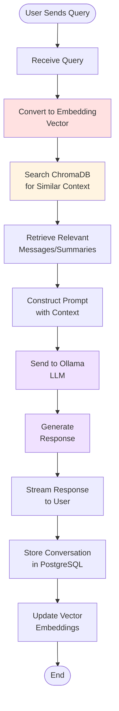
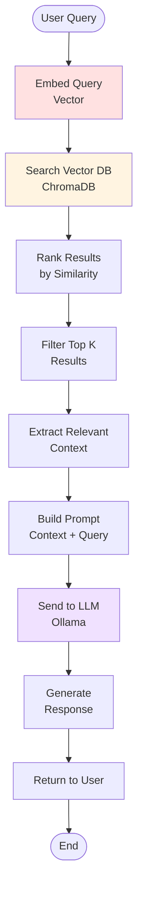
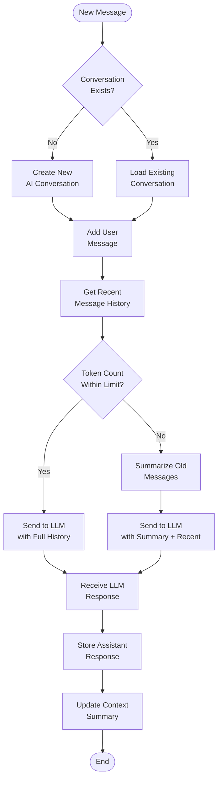
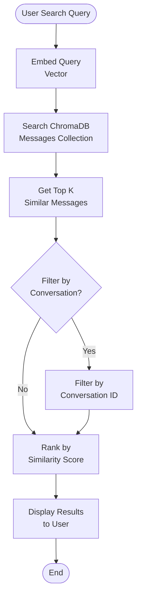
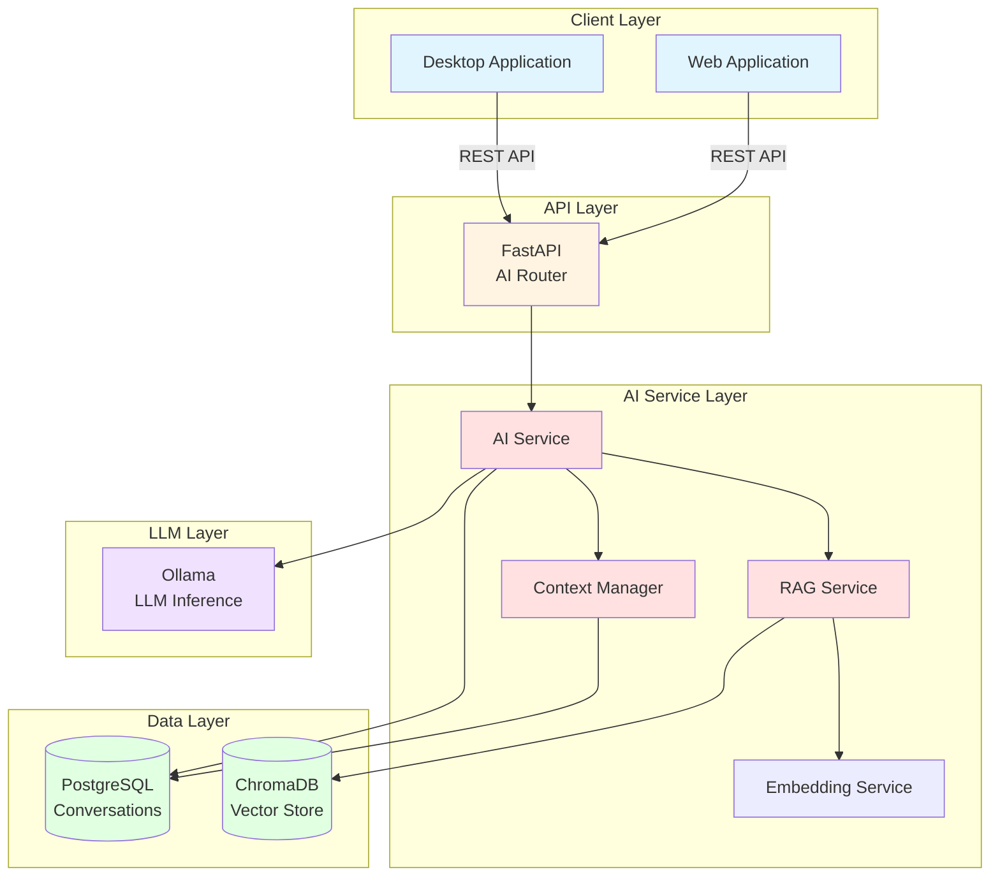

# AI Architecture - QuantumResilientCommunication

## Overview

This document describes the AI architecture for the Quantum-Resilient Communication System. The AI service provides intelligent features including an AI assistant, conversation summaries, and smart search capabilities. The architecture uses Retrieval-Augmented Generation (RAG) with local LLM inference for privacy and security.

---

## AI Components

### 1. AI Assistant Service

**Purpose**: Provides conversational AI assistance to users for security questions, messaging help, and general queries.

**Features**:
- Context-aware responses based on conversation history
- Security explanations and recommendations
- Natural language understanding
- Multi-turn conversation support

**Technologies**:
- LangChain for LLM orchestration
- Ollama for local LLM inference
- ChromaDB for vector storage
- PostgreSQL for conversation history

---

### 2. RAG Service (Retrieval-Augmented Generation)

**Purpose**: Enhances LLM responses with relevant context from past conversations and knowledge base.

**Components**:
- **Vector Store**: ChromaDB for semantic search
- **Embedding Model**: Converts text to vector embeddings
- **Retriever**: Finds relevant context based on user query
- **Prompt Builder**: Constructs prompts with retrieved context

**Process**:
1. User sends query
2. Query is converted to embedding vector
3. Vector store is searched for similar content
4. Relevant context is retrieved
5. Prompt is constructed with context + query
6. LLM generates response
7. Response is returned to user

---

### 3. ChromaDB (Vector Database)

**Purpose**: Stores vector embeddings for semantic search and context retrieval.

**Collections**:
- **Message Embeddings**: Vector embeddings of user messages
- **Conversation Summaries**: Summaries of past conversations
- **Knowledge Base**: Security best practices and FAQs

**Features**:
- Semantic search over message history
- Fast similarity search
- Persistent storage
- Scalable to millions of embeddings

---

### 4. Ollama (LLM Inference)

**Purpose**: Provides local LLM inference for privacy and security.

**Models**:
- **Llama 3 (8B)**: Fast, efficient for most queries
- **Llama 3 (70B)**: High-quality responses for complex queries
- **Mistral**: Balanced performance and quality
- **Custom Models**: Fine-tuned for security domain

**Features**:
- Local inference (no data leaves server)
- Streaming responses
- Context window management
- Token counting and rate limiting

---

### 5. Context Management

**Purpose**: Manages conversation history and context for AI interactions.

**Components**:
- **Conversation Store**: PostgreSQL for persistent storage
- **Context Window**: Manages token limits for LLM
- **Summarization**: Generates conversation summaries
- **History Retrieval**: Fetches relevant past messages

**Strategies**:
- **Sliding Window**: Last N messages
- **Summarization**: Summarize old messages to save tokens
- **Retrieval**: Use RAG to find relevant past messages

---

## Detailed Flow Diagrams

### AI Request Flow



---

### RAG Flow



---

### Conversation Context Flow



---

### Semantic Search Flow



---

## AI Service Architecture

### Component Diagram



---

## Data Models

### AIConversations Table

**Purpose**: Stores AI assistant conversations for users.

**Fields**:
- `ai_conversation_id`: UUID (Primary Key)
- `user_id`: UUID (Foreign Key to Users)
- `title`: VARCHAR(255) - Auto-generated or user-defined
- `context_summary`: TEXT - AI-generated summary
- `model_used`: VARCHAR(100) - LLM model identifier
- `is_active`: BOOLEAN - Conversation status
- `created_at`: TIMESTAMP
- `updated_at`: TIMESTAMP

---

### AIMessages Table

**Purpose**: Stores individual messages within AI conversations.

**Fields**:
- `ai_message_id`: UUID (Primary Key)
- `ai_conversation_id`: UUID (Foreign Key to AIConversations)
- `role`: VARCHAR(20) - 'user', 'assistant', 'system'
- `content`: TEXT - Message content
- `tokens_used`: INTEGER - Token count
- `response_time_ms`: INTEGER - LLM response time
- `created_at`: TIMESTAMP

---

### ChromaDB Collections

#### Messages Collection

**Purpose**: Stores vector embeddings of user messages for semantic search.

**Schema**:
```json
{
  "id": "uuid",
  "embedding": [float, float, ...],
  "metadata": {
    "message_id": "uuid",
    "conversation_id": "uuid",
    "user_id": "uuid",
    "created_at": "timestamp",
    "message_type": "text"
  },
  "document": "message content"
}
```

**Dimensions**: 384 (for all-MiniLM-L6-v2) or 768 (for larger models)

---

#### Summaries Collection

**Purpose**: Stores conversation summaries for context retrieval.

**Schema**:
```json
{
  "id": "uuid",
  "embedding": [float, float, ...],
  "metadata": {
    "conversation_id": "uuid",
    "user_id": "uuid",
    "created_at": "timestamp",
    "summary_type": "periodic|final"
  },
  "document": "conversation summary text"
}
```

---

#### Knowledge Base Collection

**Purpose**: Stores security best practices and FAQs.

**Schema**:
```json
{
  "id": "uuid",
  "embedding": [float, float, ...],
  "metadata": {
    "category": "security|messaging|general",
    "created_at": "timestamp"
  },
  "document": "knowledge base content"
}
```

---

## AI Features

### 1. AI Assistant

**Purpose**: Conversational AI for user assistance.

**Capabilities**:
- Answer questions about the platform
- Explain security features
- Help with messaging features
- Provide troubleshooting assistance
- Suggest security best practices

**Example Interactions**:
- "How do I enable end-to-end encryption?"
- "What post-quantum algorithms are used?"
- "How do I rotate my encryption keys?"
- "Explain the security of this messaging system"

---

### 2. Conversation Summaries

**Purpose**: Generate summaries of long conversations for quick review.

**Process**:
1. Monitor conversation length
2. When threshold reached (e.g., 50 messages), generate summary
3. Use LLM to summarize key points
4. Store summary in ChromaDB
5. Update context_summary in AIConversations

**Benefits**:
- Saves tokens in context window
- Quick conversation review
- Searchable conversation history

---

### 3. Smart Search

**Purpose**: Semantic search over message history.

**Features**:
- Search by meaning, not just keywords
- Find related messages across conversations
- Natural language queries

**Example**:
- Query: "messages about encryption keys"
- Results: All messages discussing key exchange, even if they don't contain exact phrase

---

### 4. Security Explanations

**Purpose**: Explain security features and threats in user-friendly language.

**Capabilities**:
- Explain post-quantum cryptography
- Describe encryption methods
- Warn about security risks
- Provide security recommendations

---

## Prompt Engineering

### System Prompt

```
You are a helpful AI assistant for Quantum-Resilient Communication, a secure messaging platform using post-quantum cryptography.

Your capabilities:
- Answer questions about the platform
- Explain security features (ML-KEM, ML-DSA, AES-256-GCM)
- Help with messaging features
- Provide security best practices
- Assist with account and key management

Guidelines:
- Be concise and clear
- Use simple language for technical concepts
- Prioritize security in recommendations
- Never ask for sensitive information
- If unsure, say so and suggest contacting support

Context from past conversations:
{retrieved_context}

User query: {user_query}
```

---

### Context Injection

**Format**:
```
Relevant context from past conversations:

[Message 1 - 2024-01-15]
User: How do I rotate my keys?
Assistant: To rotate your keys, go to Settings > Security > Key Rotation...

[Message 2 - 2024-01-14]
User: What is ML-KEM?
Assistant: ML-KEM (Module-Lattice Key Encapsulation Mechanism) is a post-quantum...

---

Current user query: {user_query}
```

---

## LLM Configuration

### Model Parameters

**Temperature**: 0.7 (balanced creativity and consistency)

**Max Tokens**: 500 (concise responses)

**Top P**: 0.9 (nucleus sampling)

**Frequency Penalty**: 0.3 (reduce repetition)

**Presence Penalty**: 0.3 (encourage diversity)

---

### Model Selection

**Llama 3 (8B)**:
- **Use Case**: Fast responses, simple queries
- **Context Window**: 8K tokens
- **Speed**: ~50 tokens/second
- **Quality**: Good for most queries

**Llama 3 (70B)**:
- **Use Case**: Complex queries, detailed explanations
- **Context Window**: 8K tokens
- **Speed**: ~10 tokens/second
- **Quality**: Excellent, nuanced responses

**Mistral**:
- **Use Case**: Balanced performance and quality
- **Context Window**: 32K tokens
- **Speed**: ~30 tokens/second
- **Quality**: Very good

---

## Context Management

### Context Window Strategy

**Sliding Window**:
- Keep last 10 messages in full context
- Summarize older messages
- Use RAG to retrieve relevant older messages

**Token Budget**:
- System prompt: 200 tokens
- Retrieved context: 500 tokens
- Conversation history: 1000 tokens
- Current query: 100 tokens
- Reserved for response: 500 tokens
- **Total**: ~2300 tokens (well within 8K limit)

---

### Summarization Strategy

**When to Summarize**:
- Conversation exceeds 50 messages
- Context window approaching limit
- User explicitly requests summary

**Summarization Process**:
1. Take last 20 messages (keep in full)
2. Summarize messages 21-50
3. Discard messages before 21 (or store in ChromaDB)
4. Update context_summary field

**Example Summary**:
```
User asked about encryption methods. Explained ML-KEM for key exchange,
AES-256-GCM for message encryption, and ML-DSA for signatures. User
requested key rotation instructions. Provided step-by-step guide.
```

---

## Embedding Strategy

### Embedding Model

**Recommended**: all-MiniLM-L6-v2 (384 dimensions)

**Alternative**: all-mpnet-base-v2 (768 dimensions, better quality)

**Properties**:
- Fast inference
- Good quality for semantic search
- Small model size
- Easy to deploy

---

### Embedding Process

**When to Embed**:
- New message sent
- New AI conversation created
- Conversation summary generated

**Process**:
1. Extract text content
2. Truncate to 512 tokens (model limit)
3. Generate embedding vector
4. Store in ChromaDB with metadata

---

## Privacy and Security

### Data Privacy

**Principles**:
- All AI processing happens on local servers (Ollama)
- No data sent to third-party APIs
- Conversation history stored in user's database
- User can delete AI conversations at any time

**Data Retention**:
- AI conversations stored indefinitely (user can delete)
- Vector embeddings stored in ChromaDB
- Summaries stored in PostgreSQL and ChromaDB

---

### Security Considerations

**Prompt Injection**:
- Sanitize user input before sending to LLM
- Use system prompts to define boundaries
- Monitor for suspicious patterns
- Limit LLM capabilities (no code execution, no external API calls)

**Data Leakage**:
- Never include sensitive data in prompts (passwords, keys)
- Redact personal information before embedding
- Use separate collections for different sensitivity levels

**Access Control**:
- Users can only access their own AI conversations
- Vector embeddings are user-specific
- API endpoints require authentication

---

## Performance Optimization

### Caching

**Strategies**:
- Cache common queries and responses
- Cache embeddings for frequently accessed messages
- Cache LLM responses for identical queries (within session)

**Implementation**:
- Redis for response caching
- In-memory cache for embeddings
- TTL: 1 hour for responses, 24 hours for embeddings

---

### Batch Processing

**Embedding Generation**:
- Batch embed multiple messages at once
- Process in background during low traffic
- Queue system for high-volume periods

**Summarization**:
- Generate summaries asynchronously
- Process in batches during off-peak hours
- Priority queue for active conversations

---

### Rate Limiting

**Per User**:
- 20 AI messages per hour
- 10 summarization requests per day
- 50 semantic searches per hour

**Global**:
- 100 concurrent LLM requests
- 1000 embedding requests per minute
- Queue system for overload protection

---

## Monitoring and Observability

### Metrics

**Performance**:
- LLM response time (P50, P95, P99)
- Embedding generation time
- ChromaDB query time
- Token usage per request

**Usage**:
- AI messages per user
- Most common query types
- Model usage distribution
- Error rates

**Quality**:
- User feedback scores
- Response relevance (if feedback collected)
- Hallucination detection (future)

---

### Logging

**Logs to Capture**:
- User queries (anonymized)
- LLM responses
- Retrieved context
- Errors and timeouts
- Token usage

**Log Format**:
```json
{
  "timestamp": "2024-01-15T10:30:00Z",
  "user_id": "uuid",
  "conversation_id": "uuid",
  "query_length": 50,
  "response_length": 200,
  "tokens_used": 150,
  "response_time_ms": 2500,
  "model": "llama3:8b",
  "context_items": 3,
  "error": null
}
```

---

## Error Handling

### Common Errors

1. **LLM Timeout**
   - Retry with shorter timeout
   - Fallback to smaller model
   - Return error to user

2. **ChromaDB Unavailable**
   - Fall back to conversation history only
   - Log error for investigation
   - Notify user of degraded experience

3. **Context Too Long**
   - Summarize older messages
   - Truncate to fit context window
   - Notify user if context was truncated

4. **Embedding Generation Failed**
   - Retry with exponential backoff
   - Queue for later processing
   - Use cached embedding if available

---

## Future Enhancements

### Version 2

1. **Multi-modal Support**: Process images and files
2. **Voice Interface**: Voice input and output
3. **Personalization**: Learn user preferences
4. **Proactive Suggestions**: Suggest actions based on context

### Version 3

1. **Security Analysis**: Analyze messages for threats
2. **Phishing Detection**: Detect suspicious messages
3. **Anomaly Detection**: Identify unusual behavior
4. **Smart Replies**: Suggest message responses
5. **Message Translation**: Real-time translation
6. **Sentiment Analysis**: Analyze conversation sentiment

---

## Integration with Messaging

### AI in Conversations

**Future Feature**: AI assistant can participate in regular conversations.

**Use Cases**:
- Summarize long conversations
- Translate messages in real-time
- Suggest replies
- Flag suspicious content
- Provide context for new participants

**Implementation**:
- AI as a conversation participant
- Special message type: 'ai_assistant'
- Triggered by @ai mention or automatic

---

## References

1. LangChain Documentation: https://python.langchain.com/
2. Ollama Documentation: https://ollama.ai/
3. ChromaDB Documentation: https://docs.trychroma.com/
4. Retrieval-Augmented Generation: https://arxiv.org/abs/2005.11401
5. Llama 3: https://ai.meta.com/blog/meta-llama-3/
6. Mistral AI: https://mistral.ai/