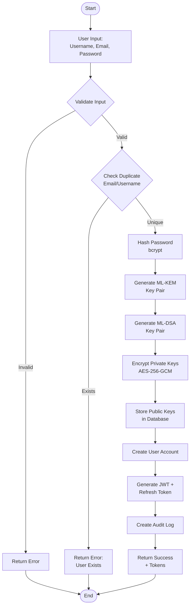
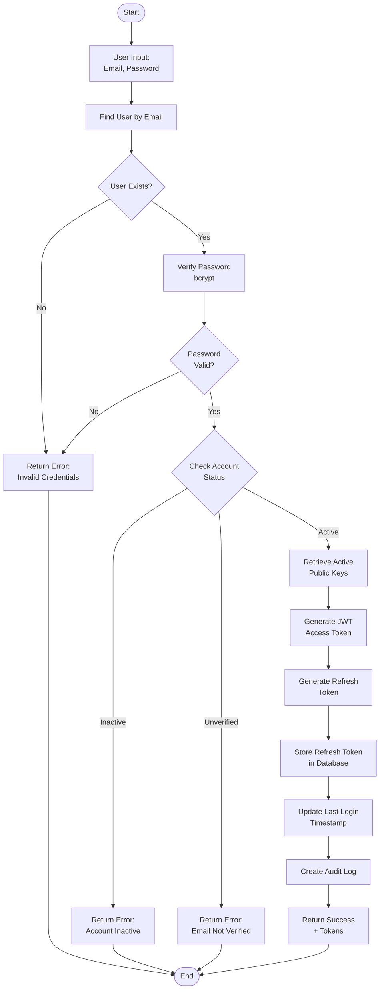
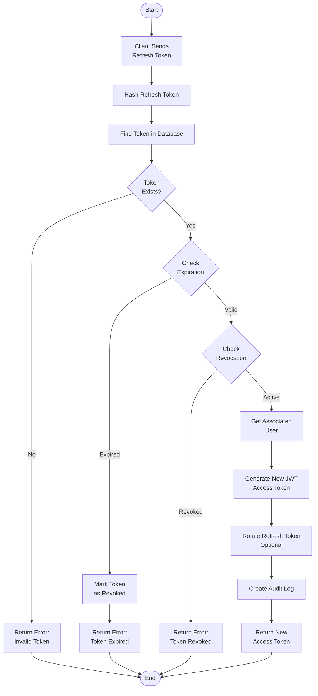
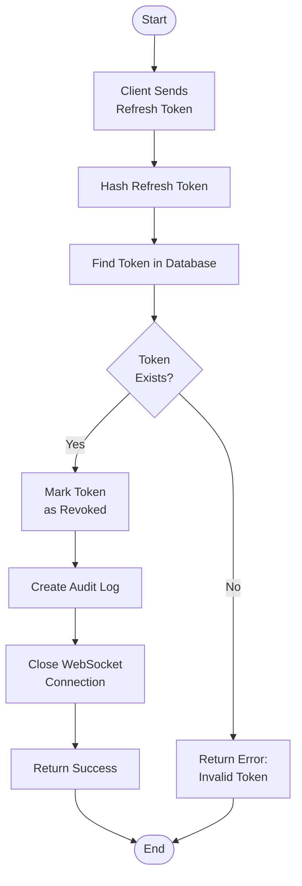

# Authentication Flow - QuantumResilientCommunication

## Overview

This document describes the complete authentication flow for the Quantum-Resilient Communication System, including user registration, login, and session management. The authentication system integrates post-quantum cryptography for enhanced security.

---

## Authentication Components

### 1. User Registration Flow

The registration process generates post-quantum key pairs and securely stores them for future communications.

**Steps**:
1. User provides registration details (username, email, password)
2. System validates input and checks for duplicates
3. System generates ML-KEM key pair for key encapsulation
4. System generates ML-DSA key pair for digital signatures
5. Private keys are encrypted with AES-256-GCM before storage
6. Public keys are stored in the database
7. Password is hashed using bcrypt
8. User account is created
9. JWT access token and refresh token are issued
10. User is automatically logged in

---

### 2. User Login Flow

The login process verifies user credentials and issues authentication tokens.

**Steps**:
1. User provides email and password
2. System retrieves user record from database
3. System verifies password hash using bcrypt
4. System validates user account status (active, verified)
5. System retrieves user's active post-quantum public keys
6. JWT access token is generated (short-lived, 15 minutes)
7. Refresh token is generated and stored (long-lived, 7 days)
8. Session information is recorded (IP, user agent)
9. Last login timestamp is updated
10. Tokens are returned to client

---

### 3. Token Refresh Flow

The refresh flow allows users to obtain new access tokens without re-entering credentials.

**Steps**:
1. Client sends refresh token to /auth/refresh endpoint
2. System validates refresh token hash
3. System checks token expiration and revocation status
4. System retrieves associated user account
5. New JWT access token is generated
6. Refresh token rotation (optional, for enhanced security)
7. New tokens are returned to client

---

### 4. Logout Flow

The logout flow invalidates the current session.

**Steps**:
1. Client sends refresh token to /auth/logout endpoint
2. System marks refresh token as revoked
3. Audit log entry is created
4. Client clears local tokens
5. WebSocket connection is closed (if active)

---

## Detailed Flow Diagrams

### Registration Flow



---

### Login Flow



---

### Token Refresh Flow



---

### Logout Flow



---

## Post-Quantum Key Generation

### ML-KEM Key Pair Generation

**Purpose**: Used for secure key exchange (encapsulation/decapsulation).

**Process**:
1. Generate random ML-KEM key pair using liboqs
2. Public key is stored in plaintext (base64 encoded)
3. Private key is encrypted with AES-256-GCM before storage
4. Key version is assigned for rotation tracking
5. Key is marked as active

**Storage**:
- `kem_public_key`: Plaintext (base64)
- `kem_private_key_encrypted`: AES-256-GCM encrypted (base64)

---

### ML-DSA Key Pair Generation

**Purpose**: Used for digital signatures (message authentication).

**Process**:
1. Generate random ML-DSA key pair using liboqs
2. Public key is stored in plaintext (base64 encoded)
3. Private key is encrypted with AES-256-GCM before storage
4. Key version is assigned for rotation tracking
5. Key is marked as active

**Storage**:
- `signature_public_key`: Plaintext (base64)
- `signature_private_key_encrypted`: AES-256-GCM encrypted (base64)

---

## JWT Token Structure

### Access Token Payload

```json
{
  "sub": "user_id",
  "username": "john_doe",
  "email": "john@example.com",
  "exp": 1234567890,
  "iat": 1234567890,
  "type": "access"
}
```

**Claims**:
- `sub`: User ID (subject)
- `username`: User's display name
- `email`: User's email address
- `exp`: Expiration timestamp (15 minutes)
- `iat`: Issued at timestamp
- `type`: Token type ("access")

---

### Refresh Token Storage

**Fields**:
- `token_id`: UUID
- `user_id`: Foreign key to Users
- `token_hash`: SHA-256 hash of token
- `expires_at`: Expiration timestamp (7 days)
- `created_at`: Issuance timestamp
- `revoked_at`: Revocation timestamp (NULL if active)
- `user_agent`: Client user agent
- `ip_address`: Client IP address

**Security**:
- Tokens are hashed before storage (SHA-256)
- Tokens can be revoked individually
- Rotation is supported for enhanced security
- IP and user agent tracking for audit

---

## Session Management

### Active Sessions

Users can have multiple active sessions (multi-device support).

**Tracking**:
- Each refresh token represents one session
- Sessions are tracked in RefreshTokens table
- User agent and IP address are recorded
- Sessions can be revoked individually or all at once

### Session Revocation

**Scenarios**:
1. User logs out
2. User changes password
3. Admin revokes session
4. Token is compromised
5. Security policy violation

**Process**:
1. Token is marked as revoked in database
2. Audit log entry is created
3. WebSocket connection is closed
4. Client is notified (if connected)

---

## Security Considerations

### Password Security
- **Hashing**: Bcrypt with cost factor 12
- **Salt**: Automatically generated by bcrypt
- **Minimum Length**: 8 characters
- **Complexity**: Enforced at application level

### Token Security
- **Access Tokens**: Short-lived (15 minutes)
- **Refresh Tokens**: Long-lived (7 days), revocable
- **Token Storage**: HTTP-only cookies (recommended) or secure storage
- **Token Transmission**: Only over HTTPS

### Key Security
- **Private Keys**: Encrypted with AES-256-GCM before storage
- **Key Rotation**: Supported via versioning
- **Key Revocation**: Immediate via revoked_at timestamp
- **Key Backup**: Encrypted backup for account recovery (future)

### Audit Logging

All authentication events are logged:

**Events**:
- User registration
- User login (success/failure)
- Token refresh
- Logout
- Password change
- Key rotation
- Session revocation

**Logged Data**:
- User ID
- Event type
- IP address
- User agent
- Timestamp
- Additional event data (JSONB)

---

## Error Handling

### Common Authentication Errors

1. **Invalid Credentials**
   - HTTP 401 Unauthorized
   - Message: "Invalid email or password"

2. **Account Not Verified**
   - HTTP 403 Forbidden
   - Message: "Please verify your email address"

3. **Account Inactive**
   - HTTP 403 Forbidden
   - Message: "Your account has been deactivated"

4. **Token Expired**
   - HTTP 401 Unauthorized
   - Message: "Access token expired"

5. **Token Revoked**
   - HTTP 401 Unauthorized
   - Message: "Token has been revoked"

6. **Invalid Refresh Token**
   - HTTP 401 Unauthorized
   - Message: "Invalid refresh token"

---

## Rate Limiting

### Login Endpoint
- **Limit**: 5 attempts per 15 minutes per IP
- **Purpose**: Prevent brute force attacks
- **Implementation**: Redis-based rate limiter

### Registration Endpoint
- **Limit**: 3 attempts per hour per IP
- **Purpose**: Prevent spam registrations
- **Implementation**: Redis-based rate limiter

### Token Refresh Endpoint
- **Limit**: 10 attempts per 5 minutes per user
- **Purpose**: Prevent token abuse
- **Implementation**: Redis-based rate limiter

---

## Multi-Factor Authentication (Future)

### Planned Implementation
- TOTP (Time-based One-Time Password)
- WebAuthn (FIDO2/Passkeys)
- SMS/Email OTP

### Flow
1. User enables MFA in settings
2. System generates MFA secret
3. User scans QR code or receives OTP
4. MFA is enabled for account
5. Login requires both password and MFA code

---

## Password Reset Flow (Future)

### Process
1. User requests password reset
2. System generates secure reset token
3. Reset link sent to user email
4. User clicks link and enters new password
5. System validates reset token
6. Password is updated
7. All sessions are revoked
8. User must log in again

---

## Account Verification Flow

### Process
1. User registers
2. System generates verification token
3. Verification email sent to user
4. User clicks verification link
5. System validates token
6. Account is marked as verified
7. User can now log in

---

## Best Practices

### Client-Side
- Store tokens securely (HTTP-only cookies preferred)
- Never store passwords
- Use HTTPS for all requests
- Implement token refresh before expiration
- Clear tokens on logout

### Server-Side
- Validate all tokens on every request
- Use short-lived access tokens
- Implement proper error handling
- Log all authentication events
- Rate limit authentication endpoints
- Use secure random number generators for tokens

### Database
- Index email and username for fast lookups
- Hash all tokens before storage
- Use transactions for critical operations
- Implement connection pooling
- Regular security audits