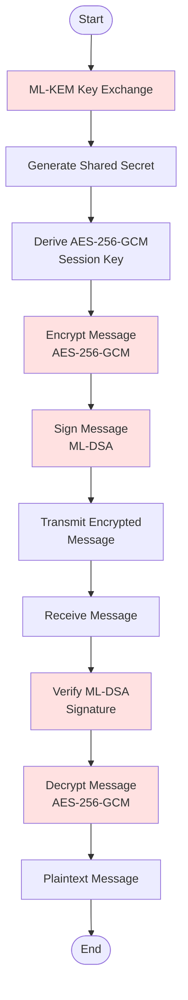
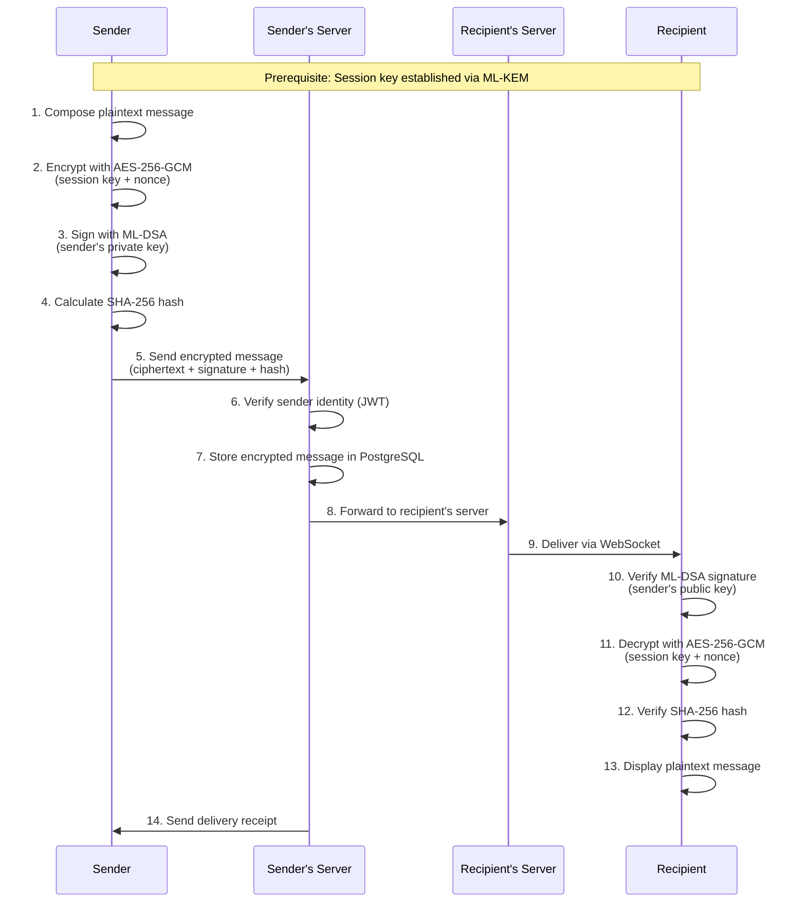
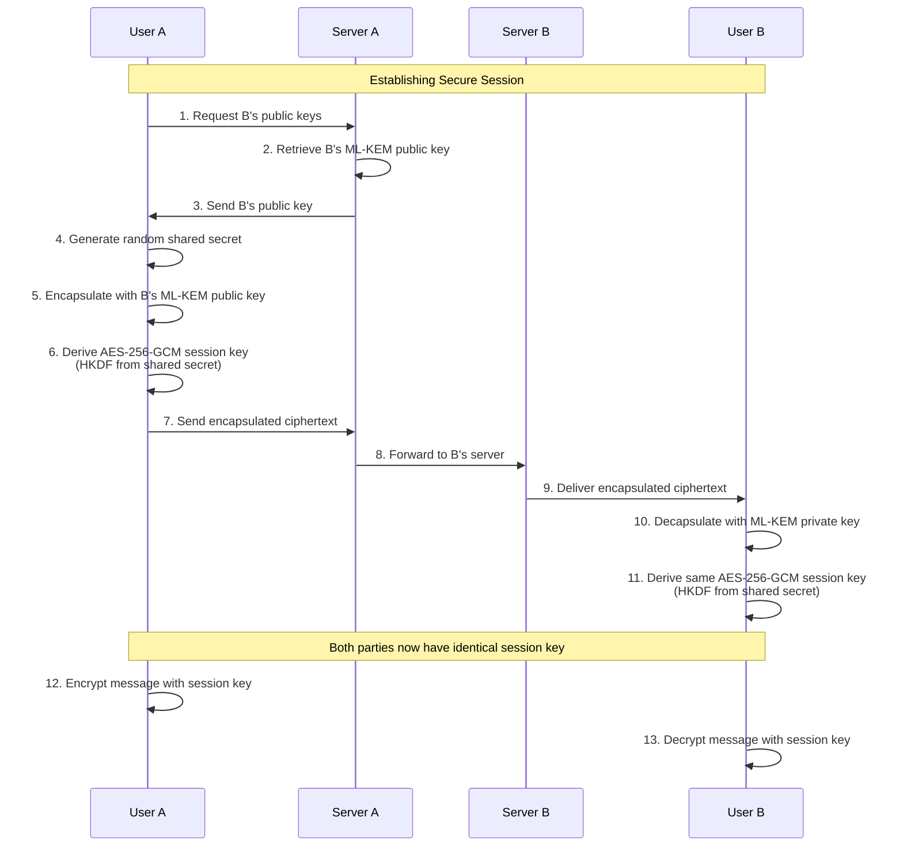

# Encryption Flow - QuantumResilientCommunication

## Overview

This document describes the complete cryptography process for the Quantum-Resilient Communication System. The system implements a hybrid post-quantum cryptography stack that provides security against both classical and quantum computing threats.

**Cryptography Stack:**
- **Key Encapsulation**: ML-KEM (Module-Lattice Key Encapsulation Mechanism, FIPS 203)
- **Digital Signatures**: ML-DSA (Module-Lattice Digital Signature Algorithm, FIPS 204)
- **Symmetric Encryption**: AES-256-GCM (Advanced Encryption Standard)

---

## Cryptographic Principles

### Post-Quantum Cryptography

Post-quantum cryptography (PQC) refers to cryptographic algorithms that are secure against attacks by quantum computers. Traditional algorithms like RSA and ECC are vulnerable to Shor's algorithm, which can be efficiently run on quantum computers.

**Why Post-Quantum Cryptography?**
- Quantum computers are becoming a reality
- "Harvest now, decrypt later" attacks are a threat
- NIST has standardized ML-KEM and ML-DSA for future-proof security
- Long-term data protection requires quantum-resistant algorithms

### Defense in Depth

The system implements multiple layers of encryption:

1. **Key Exchange Layer**: ML-KEM for secure session key establishment
2. **Authentication Layer**: ML-DSA for message signing and verification
3. **Encryption Layer**: AES-256-GCM for message content protection
4. **Storage Layer**: AES-256-GCM for private key encryption at rest

---

## Complete Encryption Flow

### High-Level Flow



---

## Detailed Cryptographic Processes

### 1. ML-KEM Key Exchange

**Purpose**: Securely establish a shared secret between two parties without transmitting the secret itself.

**Algorithm**: ML-KEM (Module-Lattice Key Encapsulation Mechanism, FIPS 203)

**Process**:

#### Sender Side (Encapsulation)
1. Generate random ML-KEM key pair (if not already done)
2. Obtain recipient's ML-KEM public key
3. Use recipient's public key to encapsulate a shared secret
4. Send encapsulated ciphertext to recipient
5. Store the shared secret for session key derivation

**Input**: Recipient's public key
**Output**: Encapsulated ciphertext + Shared secret

#### Recipient Side (Decapsulation)
1. Use private ML-KEM key to decapsulate the ciphertext
2. Derive the same shared secret as the sender
3. Use the shared secret for session key derivation

**Input**: Encapsulated ciphertext + Private key
**Output**: Shared secret

**Security Properties**:
- **Quantum-resistant**: Secure against quantum computer attacks
- **Forward secrecy**: Compromise of long-term keys doesn't expose past sessions
- **Authenticated**: Only the holder of the private key can decapsulate

**Storage**:
- Public key: Stored in plaintext (base64 encoded)
- Private key: Encrypted with AES-256-GCM before database storage

---

### 2. AES-256-GCM Session Key

**Purpose**: Derive a symmetric session key from the ML-KEM shared secret for efficient message encryption.

**Algorithm**: AES-256-GCM (Advanced Encryption Standard with Galois/Counter Mode)

**Process**:
1. Receive shared secret from ML-KEM key exchange
2. Use HKDF (HMAC-based Extract-and-Expand Key Derivation Function) to derive session key
3. Session key is 256 bits (32 bytes) for AES-256
4. Session key is used for symmetric encryption/decryption

**Key Derivation**:
```
Shared Secret (ML-KEM)
    ↓
HKDF-SHA256
    ↓
AES-256-GCM Session Key (256 bits)
```

**Security Properties**:
- **Symmetric encryption**: Fast encryption/decryption
- **Authenticated**: GCM mode provides authentication
- **Confidentiality**: 256-bit key provides strong security
- **Integrity**: GCM mode includes integrity verification

**Session Key Lifetime**:
- One session key per conversation
- Session key is rotated periodically (e.g., every 24 hours)
- Session key is discarded when conversation ends

---

### 3. Message Encryption

**Purpose**: Encrypt message content using the session key.

**Algorithm**: AES-256-GCM

**Process**:
1. Obtain plaintext message content
2. Generate random 96-bit nonce (IV) for each message
3. Encrypt plaintext with AES-256-GCM using session key and nonce
4. Output: ciphertext + authentication tag
5. Store nonce with ciphertext (nonce doesn't need to be secret)

**Input**: Plaintext message + Session key + Nonce
**Output**: Encrypted ciphertext + Authentication tag

**Example**:
```
Plaintext: "Hello, this is a secret message"
Nonce: 0x7a3b9c2d4e5f6a7b8c9d0e1f (96 bits)
Session Key: 0x2b7e151628aed2a6abf7158809cf4f3c... (256 bits)

Ciphertext: 0x8a3f2c9d4e5b6a7c8d9e0f1a2b3c4d5...
Auth Tag: 0x9f8e7d6c5b4a3f2e1d0c9b8a7f6e5d4...
```

**Security Properties**:
- **Confidentiality**: Message content is encrypted
- **Integrity**: Authentication tag verifies message integrity
- **Authenticity**: Only holders of the session key can encrypt/decrypt
- **Nonce uniqueness**: Each message uses a unique nonce

---

### 4. ML-DSA Digital Signatures

**Purpose**: Authenticate message sender and ensure message integrity.

**Algorithm**: ML-DSA (Module-Lattice Digital Signature Algorithm, FIPS 204)

**Process**:

#### Signing (Sender Side)
1. Obtain message content (or hash of content)
2. Use sender's ML-DSA private key to sign the message
3. Output: digital signature

**Input**: Message + Private key
**Output**: Digital signature

#### Verification (Recipient Side)
1. Obtain message content and digital signature
2. Use sender's ML-DSA public key to verify signature
3. Output: Valid/Invalid

**Input**: Message + Signature + Public key
**Output**: Verification result

**Security Properties**:
- **Authentication**: Verifies message sender identity
- **Integrity**: Detects message tampering
- **Non-repudiation**: Sender cannot deny sending the message
- **Quantum-resistant**: Secure against quantum computer attacks

**Storage**:
- Public key: Stored in plaintext (base64 encoded)
- Private key: Encrypted with AES-256-GCM before database storage

---

### 5. Content Hash Verification

**Purpose**: Additional integrity verification for stored messages.

**Algorithm**: SHA-256

**Process**:
1. Calculate SHA-256 hash of plaintext message content
2. Store hash alongside encrypted message
3. On decryption, verify hash matches

**Input**: Plaintext message
**Output**: 256-bit hash

**Security Properties**:
- **Integrity**: Detects any modification to message content
- **Collision resistance**: Extremely unlikely to find two messages with same hash
- **Fast computation**: Efficient to calculate and verify

---

## Complete Message Flow

### Sending a Message



---

### Key Exchange Flow



---

## Key Management

### Key Generation

**When**: During user registration

**Process**:
1. Generate ML-KEM key pair (512, 768, or 1024-bit security level)
2. Generate ML-DSA key pair (corresponding security level)
3. Encrypt private keys with AES-256-GCM master key
4. Store public keys and encrypted private keys in database
5. Assign key version number (starting at 1)
6. Mark key as active

**Security Level Selection**:
- **ML-KEM-768**: 128-bit security (recommended for most use cases)
- **ML-KEM-1024**: 192-bit security (high-security applications)
- **ML-DSA-65**: 128-bit security (matches ML-KEM-768)
- **ML-DSA-87**: 192-bit security (matches ML-KEM-1024)

---

### Key Storage

**Database Storage**:

| Field | Type | Description |
|-------|------|-------------|
| `kem_public_key` | TEXT | ML-KEM public key (base64, plaintext) |
| `kem_private_key_encrypted` | TEXT | ML-KEM private key (base64, AES-256-GCM encrypted) |
| `signature_public_key` | TEXT | ML-DSA public key (base64, plaintext) |
| `signature_private_key_encrypted` | TEXT | ML-DSA private key (base64, AES-256-GCM encrypted) |
| `key_version` | INTEGER | Version number for rotation |
| `is_active` | BOOLEAN | Whether this is the current active key |
| `created_at` | TIMESTAMP | Key generation time |
| `expires_at` | TIMESTAMP | Optional expiration time |
| `revoked_at` | TIMESTAMP | Revocation time if compromised |

**Encryption at Rest**:
- Private keys are encrypted with AES-256-GCM before storage
- Master key is stored in environment variable or HSM
- Key derivation uses PBKDF2 or similar for master key

---

### Key Rotation

**When**: Periodically (e.g., every 90 days) or when key is compromised

**Process**:
1. Generate new ML-KEM and ML-DSA key pairs
2. Increment key version number
3. Mark old key as inactive (is_active = FALSE)
4. Mark new key as active (is_active = TRUE)
5. Set revoked_at timestamp on old key
6. Notify user of key rotation
7. Old messages remain decryptable with old keys

**Benefits**:
- Limits exposure if a key is compromised
- Maintains backward compatibility for old messages
- Supports security best practices

---

### Key Revocation

**When**: Key is compromised or user requests revocation

**Process**:
1. Set revoked_at timestamp on key
2. Set is_active = FALSE
3. Generate new key pair
4. Mark new key as active
5. Log revocation event in audit log
6. Notify user

**Immediate Effects**:
- Key can no longer be used for new messages
- Existing messages remain readable (keys not deleted)
- User must re-establish session keys with contacts

---

## Session Key Management

### Session Key Establishment

**When**: When users start a new conversation or session expires

**Process**:
1. User A obtains User B's ML-KEM public key
2. User A generates random shared secret
3. User A encapsulates shared secret using ML-KEM
4. User A sends encapsulated ciphertext to User B
5. User B decapsulates ciphertext using ML-KEM private key
6. Both users derive AES-256-GCM session key from shared secret
7. Session key is used for message encryption

**Session Key Lifetime**:
- 24 hours (configurable)
- Automatically rotated after expiration
- New session key requires new ML-KEM exchange

---

### Session Key Storage

**In-Memory Storage**:
- Session keys stored in application memory (not database)
- Keys are per-conversation
- Keys are discarded when conversation ends
- Keys are rotated periodically

**Security**:
- Never stored in database
- Never transmitted over network
- Derived from ML-KEM shared secret
- Unique per conversation

---

## Encryption Algorithms Details

### ML-KEM (FIPS 203)

**Full Name**: Module-Lattice Key Encapsulation Mechanism

**Purpose**: Secure key exchange resistant to quantum attacks

**Parameters**:
- **ML-KEM-512**: 128-bit security, smaller keys
- **ML-KEM-768**: 192-bit security, balanced (recommended)
- **ML-KEM-1024**: 256-bit security, maximum security

**Key Sizes**:
- Public key: 800 bytes (ML-KEM-768)
- Private key: 1632 bytes (ML-KEM-768)
- Ciphertext: 1088 bytes (ML-KEM-768)
- Shared secret: 32 bytes

**Performance**:
- Key generation: ~1000 cycles
- Encapsulation: ~1500 cycles
- Decapsulation: ~2000 cycles

**Use Case**: Establish shared secret for session key derivation

---

### ML-DSA (FIPS 204)

**Full Name**: Module-Lattice Digital Signature Algorithm

**Purpose**: Digital signatures resistant to quantum attacks

**Parameters**:
- **ML-DSA-44**: 128-bit security, smaller signatures
- **ML-DSA-65**: 192-bit security, balanced (recommended)
- **ML-DSA-87**: 256-bit security, maximum security

**Key Sizes**:
- Public key: 1312 bytes (ML-DSA-65)
- Private key: 2560 bytes (ML-DSA-65)
- Signature: 3293 bytes (ML-DSA-65)

**Performance**:
- Key generation: ~5000 cycles
- Signing: ~3000 cycles
- Verification: ~8000 cycles

**Use Case**: Sign messages for authentication and integrity

---

### AES-256-GCM

**Full Name**: Advanced Encryption Standard with Galois/Counter Mode

**Purpose**: Symmetric encryption for message content

**Parameters**:
- Key size: 256 bits (32 bytes)
- Block size: 128 bits (16 bytes)
- Nonce size: 96 bits (12 bytes)
- Tag size: 128 bits (16 bytes)

**Performance**:
- Encryption: ~1.5 cycles/byte
- Decryption: ~1.5 cycles/byte

**Security Properties**:
- **Confidentiality**: AES-256 provides strong encryption
- **Integrity**: GCM mode provides authentication tag
- **Authenticity**: Only key holder can encrypt/decrypt
- **Nonce reuse protection**: GCM fails securely if nonce reused

**Use Case**: Encrypt message content with session key

---

## Security Considerations

### Quantum Resistance

**Threat Model**:
- Adversary has access to quantum computer
- Adversary can intercept and store encrypted communications
- Adversary may decrypt stored communications when quantum computer is available

**Protection**:
- ML-KEM and ML-DSA are quantum-resistant
- AES-256 is considered quantum-resistant (Grover's algorithm provides only sqrt speedup)
- "Harvest now, decrypt later" attacks are mitigated

---

### Forward Secrecy

**Definition**: Compromise of long-term keys does not expose past session keys

**Implementation**:
- Session keys are derived from ephemeral ML-KEM shared secrets
- Session keys are not stored long-term
- Session keys are rotated periodically
- Compromise of user's private keys does not expose past messages

---

### Backward Secrecy

**Definition**: Compromise of session keys does not expose future session keys

**Implementation**:
- Session keys are rotated periodically
- New session keys require new ML-KEM exchange
- Compromise of one session key does not affect future sessions

---

### Key Compromise Scenarios

#### Scenario 1: User's Private Keys Compromised
**Impact**: Attacker can decrypt future messages and sign messages as user
**Mitigation**:
- Key rotation to generate new keys
- Revocation of compromised keys
- Audit log analysis to detect misuse
- User notification

#### Scenario 2: Session Key Compromised
**Impact**: Attacker can decrypt messages in current session
**Mitigation**:
- Session key rotation (every 24 hours)
- Short session key lifetime
- Forward secrecy protects past sessions

#### Scenario 3: Database Compromised
**Impact**: Attacker obtains encrypted private keys and encrypted messages
**Mitigation**:
- Private keys are encrypted with AES-256-GCM
- Messages are encrypted with session keys
- Session keys are not stored in database
- Attacker cannot decrypt without master key

---

## Implementation Considerations

### Cryptographic Libraries

**Recommended Libraries**:
- **liboqs**: Open Quantum Safe library for ML-KEM and ML-DSA
- **cryptography**: Python library for AES-256-GCM
- **pycryptodome**: Alternative for AES operations

**Validation**:
- Use NIST-validated implementations
- Regular security audits
- Follow cryptographic best practices

---

### Random Number Generation

**Requirements**:
- Cryptographically secure random number generators (CSPRNG)
- OS-provided randomness (/dev/urandom, CryptGenRandom)
- Never use predictable random sources

**Usage**:
- Key generation
- Nonce generation
- Session key derivation

---

### Side-Channel Attacks

**Considerations**:
- Constant-time implementations to prevent timing attacks
- Memory protection for private keys
- Secure deletion of keys from memory
- Protection against power analysis (hardware)

---

## Compliance and Standards

### NIST Standards

- **FIPS 203**: ML-KEM specification
- **FIPS 204**: ML-DSA specification
- **FIPS 197**: AES specification
- **SP 800-38D**: GCM mode specification

### Security Standards

- **ISO/IEC 27001**: Information security management
- **SOC 2**: Service organization controls
- **GDPR**: Data protection (encryption for data security)
- **HIPAA**: Health information protection (if applicable)

---

## Future Enhancements

1. **Hybrid Mode**: Combine classical and post-quantum algorithms for transitional security
2. **Perfect Forward Secrecy**: Implement per-message keys (MessageKeys table)
3. **Key Escrow**: Encrypted backup for account recovery
4. **Hardware Security Modules**: Use HSM for key storage
5. **Quantum Key Distribution**: Explore QKD for physical layer security
6. **Algorithm Agility**: Support multiple algorithm sets for future upgrades

---

## References

1. NIST FIPS 203: Module-Lattice Key Encapsulation Mechanism (ML-KEM)
2. NIST FIPS 204: Module-Lattice Digital Signature Algorithm (ML-DSA)
3. NIST SP 800-38D: Recommendation for Block Cipher Modes of Operation
4. Open Quantum Safe (liboqs): https://openquantumsafe.org/
5. NIST Post-Quantum Cryptography: https://csrc.nist.gov/projects/post-quantum-cryptography