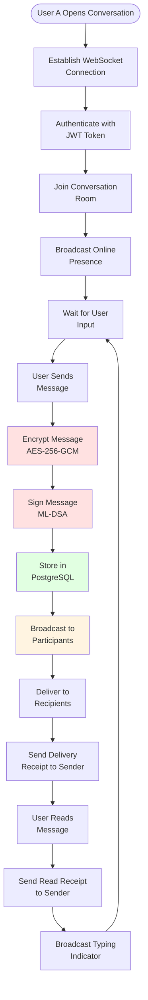
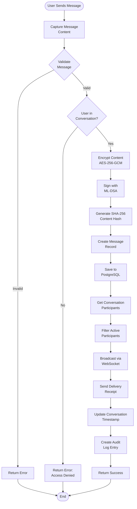
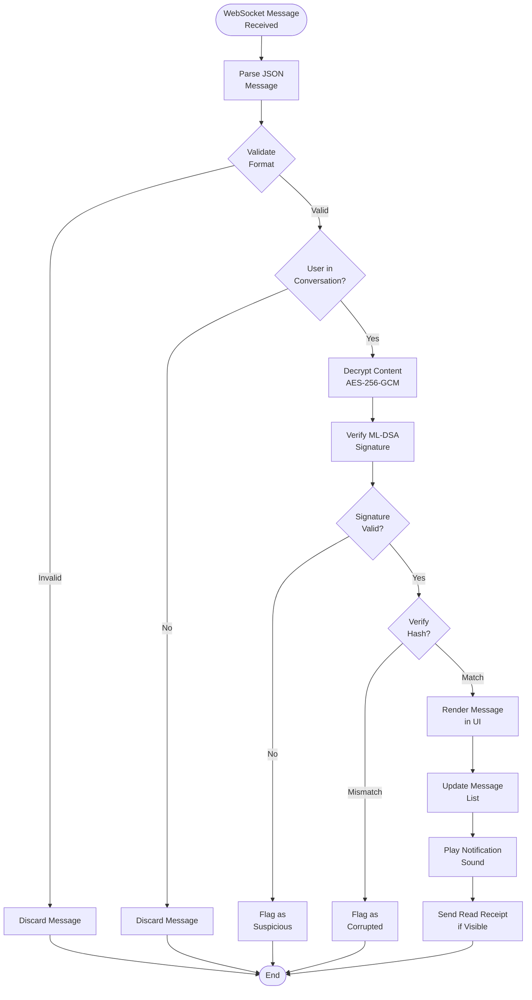
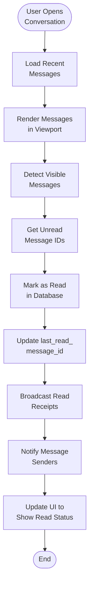
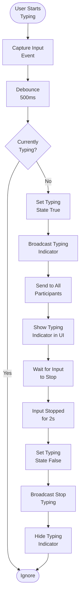
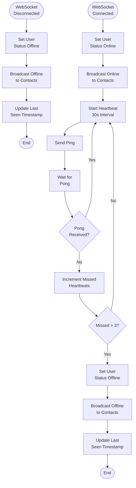
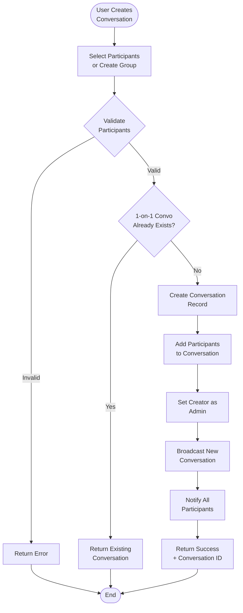
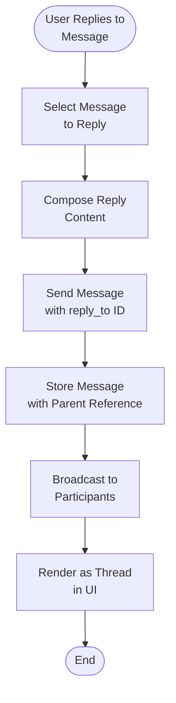
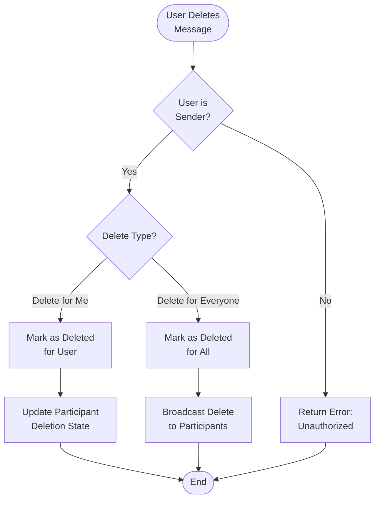

# Messaging Flow - QuantumResilientCommunication

## Overview

This document describes the complete messaging flow for the Quantum-Resilient Communication System, including real-time message delivery, conversation management, and user presence features. The messaging system uses WebSocket connections for instant communication and PostgreSQL for message persistence.

---

## Messaging Components

### 1. WebSocket Connection Management

**Purpose**: Maintains persistent bidirectional connections between clients and server.

**Features**:
- Connection pooling and lifecycle management
- Heartbeat mechanism for connection health
- Automatic reconnection support
- Connection state tracking

**Protocol**:
- WebSocket (wss://) for real-time communication
- JSON message format
- Heartbeat every 30 seconds

---

### 2. Message Encryption

**Purpose**: Ensures end-to-end encryption of all messages.

**Process**:
1. Session key established via ML-KEM key exchange
2. Message content encrypted with AES-256-GCM
3. Message signed with ML-DSA for authentication
4. Encrypted message stored in database

---

### 3. Message Delivery

**Purpose**: Delivers messages to recipients in real-time.

**Features**:
- Real-time broadcasting to conversation participants
- Offline message queuing
- Delivery confirmation
- Read receipt tracking

---

### 4. Conversation Management

**Purpose**: Manages conversations and participant relationships.

**Features**:
- 1-on-1 and group conversations
- Participant management (add/remove)
- Conversation metadata (name, avatar)
- Participant roles (admin, member)

---

### 5. Presence System

**Purpose**: Tracks user online/offline status.

**Features**:
- Online/offline status
- Last seen timestamp
- Typing indicators
- Connection quality monitoring

---

## Detailed Flow Diagrams

### Complete Messaging Flow



---

### Message Send Flow



---

### Message Receive Flow



---

### Read Receipt Flow



---

### Typing Indicator Flow



---

### Presence Update Flow



---

### Conversation Creation Flow



---

### Reply to Message Flow



---

### Delete Message Flow



---

## Message Structure

### Message Object

```json
{
  "message_id": "uuid",
  "conversation_id": "uuid",
  "sender_id": "uuid",
  "content_encrypted": "base64_encrypted_content",
  "content_hash": "sha256_hash",
  "message_type": "text",
  "reply_to": "uuid_or_null",
  "is_edited": false,
  "is_deleted": false,
  "created_at": "2024-01-15T10:30:00Z",
  "updated_at": "2024-01-15T10:30:00Z",
  "sender": {
    "user_id": "uuid",
    "username": "john_doe",
    "profile_picture_url": "https://..."
  }
}
```

---

### WebSocket Message Types

#### Client to Server

1. **auth**: Authenticate WebSocket connection
   ```json
   {
     "type": "auth",
     "token": "jwt_access_token"
   }
   ```

2. **send_message**: Send new message
   ```json
   {
     "type": "send_message",
     "conversation_id": "uuid",
     "content": "plaintext_content",
     "reply_to": "uuid_or_null"
   }
   ```

3. **typing_start**: User started typing
   ```json
   {
     "type": "typing_start",
     "conversation_id": "uuid"
   }
   ```

4. **typing_stop**: User stopped typing
   ```json
   {
     "type": "typing_stop",
     "conversation_id": "uuid"
   }
   ```

5. **mark_read**: Mark messages as read
   ```json
   {
     "type": "mark_read",
     "conversation_id": "uuid",
     "message_id": "uuid"
   }
   ```

6. **join_conversation**: Join conversation room
   ```json
   {
     "type": "join_conversation",
     "conversation_id": "uuid"
   }
   ```

7. **leave_conversation**: Leave conversation room
   ```json
   {
     "type": "leave_conversation",
     "conversation_id": "uuid"
   }
   ```

#### Server to Client

1. **new_message**: New message received
   ```json
   {
     "type": "new_message",
     "message": { /* message object */ }
   }
   ```

2. **message_sent**: Message sent confirmation
   ```json
   {
     "type": "message_sent",
     "message": { /* message object */ }
   }
   ```

3. **typing_indicator**: User typing notification
   ```json
   {
     "type": "typing_indicator",
     "conversation_id": "uuid",
     "user_id": "uuid",
     "username": "john_doe",
     "is_typing": true
   }
   ```

4. **read_receipt**: Message read notification
   ```json
   {
     "type": "read_receipt",
     "message_id": "uuid",
     "user_id": "uuid",
     "read_at": "2024-01-15T10:30:00Z"
   }
   ```

5. **presence_update**: User online/offline
   ```json
   {
     "type": "presence_update",
     "user_id": "uuid",
     "status": "online",
     "last_seen": "2024-01-15T10:30:00Z"
   }
   ```

6. **message_deleted**: Message deleted notification
   ```json
   {
     "type": "message_deleted",
     "message_id": "uuid",
     "deleted_by": "uuid",
     "delete_type": "everyone"
   }
   ```

---

## Real-time Features

### 1. Read Receipts

**Behavior**:
- Sent when user views a message
- Shows "Read" status to sender
- Includes timestamp of when message was read
- Only sent for messages in visible viewport

**Implementation**:
- Triggered on scroll event in message list
- Debounced to avoid excessive updates
- Sent via WebSocket to conversation participants

---

### 2. Delivered Status

**Behavior**:
- Sent when message reaches server
- Shows "Delivered" status to sender
- Confirms message persistence

**Implementation**:
- Sent immediately after database save
- Acknowledged by server to sender

---

### 3. Typing Indicators

**Behavior**:
- Shows "User is typing..." in conversation
- Debounced to avoid spam (500ms)
- Auto-hides after 2 seconds of inactivity
- Only shown to other participants

**Implementation**:
- Captured on input field events
- Broadcast via WebSocket
- Cleared on input stop

---

### 4. Online/Offline Presence

**Behavior**:
- Shows online/offline status in user list
- Updates in real-time
- Shows "last seen" timestamp for offline users

**Implementation**:
- Heartbeat mechanism (30s interval)
- WebSocket connection state tracking
- Graceful degradation on disconnect

---

## Message States

### Lifecycle

1. **Sending**: Message is being encrypted and sent
2. **Sent**: Message received by server
3. **Delivered**: Message stored in database
4. **Read**: Message viewed by recipient
5. **Deleted (Me)**: Message hidden for current user
6. **Deleted (Everyone)**: Message hidden for all users

---

## Error Handling

### Common Messaging Errors

1. **WebSocket Connection Failed**
   - Automatic reconnection with exponential backoff
   - Queue messages during disconnection
   - Notify user of connection status

2. **Message Send Failed**
   - Retry mechanism (3 attempts)
   - Queue for later delivery if offline
   - Notify user of failure

3. **Encryption Failed**
   - Return error to user
   - Log security event
   - Fallback to unencrypted (not recommended)

4. **User Not in Conversation**
   - Reject message send
   - Return access denied error
   - Log security event

---

## Performance Considerations

### Message Pagination

- Load 50 messages initially
- Load 20 more on scroll up
- Infinite scroll implementation
- Cursor-based pagination

### WebSocket Connection Limits

- Maximum 10 connections per user (multi-device)
- Connection pooling for efficiency
- Graceful degradation under load

### Message Broadcasting

- Batch updates for multiple recipients
- Priority queue for critical messages
- Async broadcasting to avoid blocking

---

## Security Considerations

### Message Encryption
- All messages encrypted with AES-256-GCM
- Session keys exchanged via ML-KEM
- Messages signed with ML-DSA
- Content hash for integrity verification

### Access Control
- Verify user is participant before sending
- Validate conversation membership on receive
- Prevent unauthorized message access

### Audit Logging
- Log all message sends
- Log message deletions
- Log read receipt events
- Track typing indicators (optional)

---

## Offline Support

### Message Queue

- Messages queued during disconnection
- Sent automatically on reconnection
- Queue limited to 100 messages
- Priority: read receipts > typing > messages

### Sync on Reconnect

1. Client reconnects WebSocket
2. Client sends last received message ID
3. Server sends missed messages
4. Client updates local state
5. Client sends pending read receipts

---

## Future Enhancements

1. **Message Reactions**: Emoji reactions on messages
2. **Message Threads**: Nested reply threads
3. **File Attachments**: Image, video, file sharing
4. **Voice Messages**: Audio message support
5. **Message Search**: Full-text search across conversations
6. **Message Forwarding**: Forward messages to other conversations
7. **Message Scheduling**: Schedule messages for later
8. **Message Translation**: Real-time translation