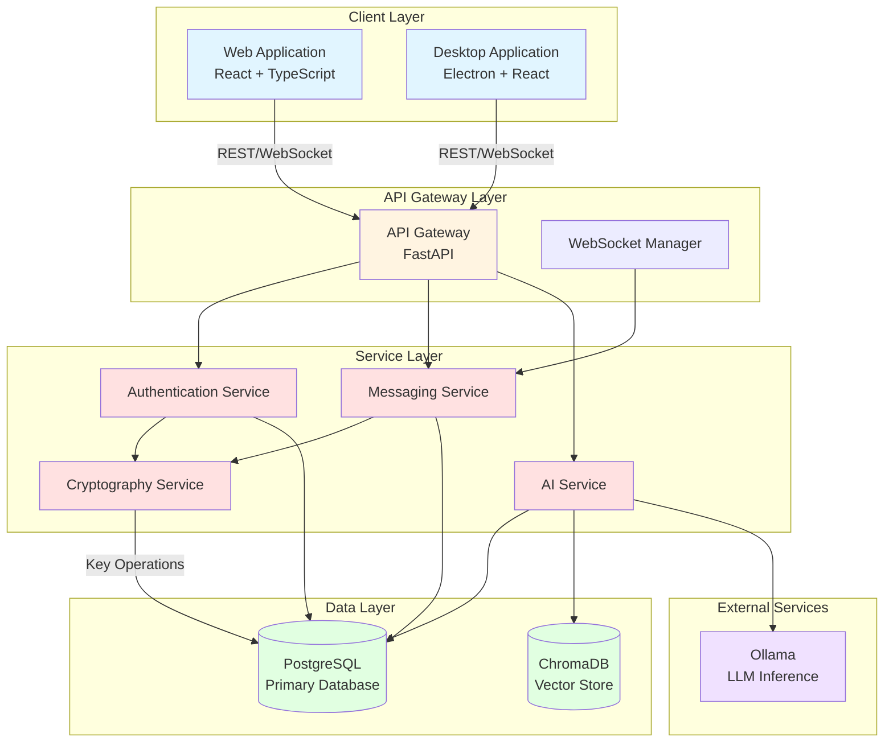

# System Architecture - QuantumResilientCommunication

## Overview

The Quantum-Resilient Communication System is a secure messaging platform that implements post-quantum cryptography and AI-powered security features. The architecture follows a microservices-oriented design with clear separation of concerns, enabling scalability, maintainability, and security.

### Key Architectural Principles

1. **Security First**: Post-quantum cryptography at every layer
2. **Scalability**: Horizontal scaling support for high availability
3. **Modularity**: Independent services for authentication, messaging, and AI
4. **Real-time**: WebSocket-based instant communication
5. **Cross-platform**: Web and desktop client support

---

## System Components

### 1. Frontend Applications

#### Web Application (React + TypeScript)
- **Framework**: React 18 with TypeScript
- **Build Tool**: Vite
- **State Management**: Redux Toolkit or Zustand
- **Real-time Communication**: Native WebSocket client
- **Cryptography**: Web Crypto API for client-side operations
- **UI Components**: Custom component library with Material-UI or Chakra UI

**Responsibilities**:
- User interface and experience
- Client-side encryption/decryption
- WebSocket connection management
- Message rendering and composition
- User authentication flows

#### Desktop Application (Electron + React)
- **Framework**: Electron with React
- **Build Tool**: Electron Builder
- **State Management**: Same as web application
- **Native Integration**: File system access, notifications

**Responsibilities**:
- Desktop-native user experience
- Local storage and caching
- System notifications
- File system integration

---

### 2. Backend Services (FastAPI)

#### Core API Service
- **Framework**: FastAPI (Python 3.9+)
- **ASGI Server**: Uvicorn
- **API Documentation**: Auto-generated OpenAPI/Swagger
- **Validation**: Pydantic schemas

**Responsibilities**:
- RESTful API endpoints
- Business logic orchestration
- Request/response validation
- Error handling and logging

---

### 3. Authentication Service

**Purpose**: Handles user authentication, authorization, and session management.

**Components**:
- **Registration**: User creation with key generation
- **Login**: Username/password verification
- **JWT Management**: Access token issuance and validation
- **Refresh Tokens**: Long-lived session management
- **Key Management**: Post-quantum key pair generation and storage

**Technologies**:
- JWT with python-jose
- Bcrypt for password hashing
- PostgreSQL for token storage

**Responsibilities**:
- User registration and login
- Password hashing and verification
- JWT token generation and validation
- Refresh token management
- Post-quantum key pair generation (ML-KEM, ML-DSA)
- Session tracking and revocation

---

### 4. Cryptography Service

**Purpose**: Handles all post-quantum cryptographic operations.

**Components**:
- **ML-KEM (Kyber)**: Key encapsulation for secure key exchange
- **ML-DSA (Dilithium)**: Digital signatures for message authentication
- **AES-256-GCM**: Symmetric encryption for message content
- **Key Management**: Key generation, storage, rotation

**Technologies**:
- liboqs (Open Quantum Safe library)
- cryptography library for AES-256-GCM
- PostgreSQL for encrypted key storage

**Responsibilities**:
- ML-KEM key pair generation
- ML-KEM encapsulation/decapsulation
- ML-DSA signing and verification
- AES-256-GCM encryption/decryption
- Key versioning and rotation
- Secure key storage

**Cryptography Stack**:
```
ML-KEM (FIPS 203)
    ↓ Key Exchange
AES-256-GCM Session Key
    ↓ Encryption
Message Content

ML-DSA (FIPS 204)
    ↓ Signing
Message Authentication
```

---

### 5. Messaging Service

**Purpose**: Handles real-time message delivery and conversation management.

**Components**:
- **WebSocket Manager**: Connection pooling and message routing
- **Message Queue**: In-memory queue for message processing
- **Conversation Manager**: Conversation creation and participant management
- **Message Store**: Persistent message storage in PostgreSQL

**Technologies**:
- FastAPI WebSockets
- asyncio for async operations
- PostgreSQL for message persistence

**Responsibilities**:
- WebSocket connection management
- Real-time message broadcasting
- Message persistence
- Conversation management
- Read receipt tracking
- Typing indicator broadcasting
- Online/offline presence tracking

---

### 6. AI Service

**Purpose**: Provides AI-powered features including assistant, security analysis, and smart features.

**Components**:
- **RAG Service**: Retrieval-Augmented Generation for context-aware responses
- **ChromaDB**: Vector database for semantic search
- **Ollama Integration**: Local LLM inference
- **Context Management**: Conversation history and summarization

**Technologies**:
- LangChain for LLM orchestration
- ChromaDB for vector storage
- Ollama for local LLM inference
- PostgreSQL for conversation history

**Responsibilities**:
- AI assistant conversations
- Context-aware responses
- Conversation summarization
- Semantic search over messages
- Security analysis (future)
- Smart suggestions

**AI Flow**:
```
User Query
    ↓
Retrieve Context (ChromaDB)
    ↓
Construct Prompt
    ↓
Ollama LLM
    ↓
Generate Response
    ↓
Return to User
```

---

### 7. WebSocket Service

**Purpose**: Manages real-time bidirectional communication.

**Components**:
- **Connection Manager**: Tracks active WebSocket connections
- **Message Router**: Routes messages to appropriate recipients
- **Event Broadcaster**: Broadcasts events (typing, presence, etc.)
- **Heartbeat**: Connection health monitoring

**Technologies**:
- FastAPI WebSockets
- asyncio for concurrent connections
- Redis (optional) for horizontal scaling

**Responsibilities**:
- WebSocket connection lifecycle
- Real-time message delivery
- Event broadcasting (typing, presence, read receipts)
- Connection health monitoring
- Graceful disconnection handling

---

### 8. PostgreSQL Database

**Purpose**: Primary data store for all application data.

**Schema**:
- Users and authentication data
- Post-quantum cryptographic keys
- Conversations and messages
- AI conversations and messages
- Refresh tokens
- Audit logs

**Features**:
- JSONB for flexible data storage
- UUID primary keys
- Comprehensive indexing
- Row-level security (optional)
- Partitioning for large tables

**Responsibilities**:
- Data persistence
- Transaction management
- Data integrity enforcement
- Query optimization
- Backup and recovery

---

### 9. Ollama (AI Models)

**Purpose**: Local LLM inference for AI features.

**Models**:
- Llama 3 (8B or 70B)
- Mistral
- Custom fine-tuned models

**Responsibilities**:
- LLM inference
- Context window management
- Token generation
- Response streaming

---

## Architecture Diagram



---

## Data Flow

### Request Flow
1. **Client** sends HTTP/WebSocket request to API Gateway
2. **API Gateway** routes to appropriate service
3. **Authentication Service** validates JWT tokens
4. **Service** processes request (may involve Cryptography Service)
5. **Service** interacts with PostgreSQL/ChromaDB
6. **Response** returned to client

### Real-time Message Flow
1. **Sender** sends message via WebSocket
2. **WebSocket Manager** receives message
3. **Cryptography Service** encrypts message
4. **Messaging Service** stores encrypted message in PostgreSQL
5. **WebSocket Manager** broadcasts to conversation participants
6. **Recipients** receive and decrypt message

### AI Request Flow
1. **User** sends query to AI assistant
2. **AI Service** retrieves conversation context from ChromaDB
3. **AI Service** constructs prompt with context
4. **Ollama** generates response
5. **AI Service** stores conversation in PostgreSQL
6. **Response** returned to user

---

## Technology Stack Summary

| Layer | Technology | Purpose |
|-------|-----------|---------|
| **Frontend Web** | React + TypeScript + Vite | Web application |
| **Frontend Desktop** | Electron + React | Desktop application |
| **Backend** | FastAPI + Python 3.9+ | API server |
| **Real-time** | WebSockets + asyncio | Instant messaging |
| **Database** | PostgreSQL 12+ | Primary data store |
| **Vector DB** | ChromaDB | AI semantic search |
| **AI/ML** | LangChain + Ollama | LLM orchestration |
| **Cryptography** | liboqs + cryptography | Post-quantum crypto |
| **Authentication** | JWT + python-jose | Session management |
| **API Docs** | OpenAPI/Swagger | Auto-generated docs |

---

## Deployment Architecture

### Development Environment
- Local PostgreSQL instance
- Local Ollama instance
- Single FastAPI server
- Hot reload enabled

### Production Environment
- **Load Balancer**: Nginx or AWS ALB
- **API Servers**: Multiple FastAPI instances (Docker containers)
- **Database**: PostgreSQL with read replicas
- **Cache**: Redis for session and presence data
- **AI Service**: Dedicated Ollama instances with GPU
- **Monitoring**: Prometheus + Grafana
- **Logging**: ELK Stack or similar

### Scalability Considerations
- **Horizontal Scaling**: API servers can be scaled independently
- **Database Scaling**: Read replicas for query load distribution
- **WebSocket Scaling**: Redis pub/sub for multi-server broadcasting
- **AI Scaling**: Dedicated GPU instances for Ollama

---

## Security Architecture

### Defense in Depth
1. **Network Layer**: TLS 1.3 for all communications
2. **Application Layer**: JWT authentication, input validation
3. **Data Layer**: Encryption at rest (AES-256-GCM)
4. **Cryptography Layer**: Post-quantum algorithms (ML-KEM, ML-DSA)

### Authentication & Authorization
- JWT access tokens (short-lived)
- Refresh tokens (long-lived, revocable)
- Post-quantum key-based authentication
- Session management and tracking

### Data Protection
- End-to-end encryption for messages
- Encrypted private key storage
- Password hashing (bcrypt)
- Audit logging for security events

---

## Monitoring & Observability

### Metrics
- API response times
- WebSocket connection count
- Message throughput
- AI response times
- Database query performance

### Logging
- Application logs (structured JSON)
- Security audit logs
- Error tracking
- Performance monitoring

### Health Checks
- Database connectivity
- Ollama availability
- WebSocket service status
- External API dependencies

---

## Future Enhancements

1. **Microservices Split**: Separate services for auth, messaging, AI
2. **Message Queue**: Redis or RabbitMQ for async processing
3. **CDN**: For file attachments and static assets
4. **Mobile Apps**: iOS and Android native applications
5. **Backup Service**: Automated encrypted backups
6. **Key Management Service**: HSM or cloud KMS for key storage
7. **Multi-region Deployment**: Geographic distribution for latency
8. **Rate Limiting**: API rate limiting and DDoS protection